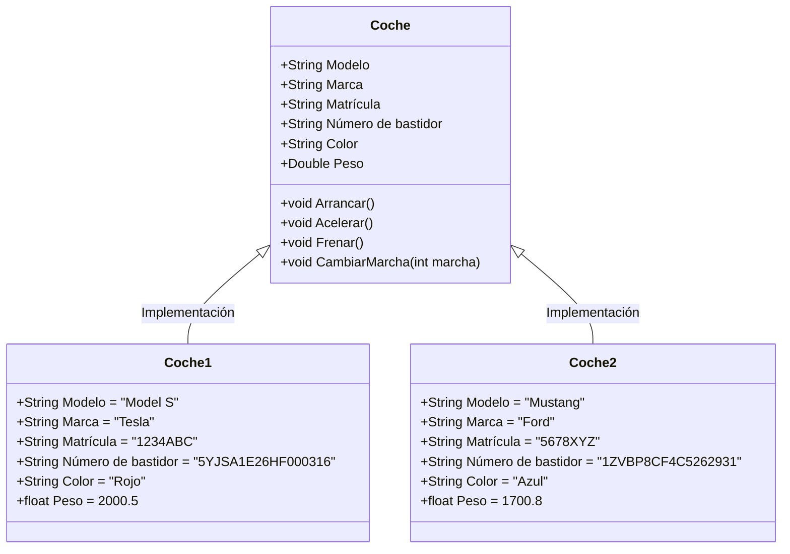
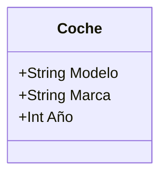

# 📘 Manual rápido de Kotlin 

## Plataformas Software Móviles (PSM) 

El contenido de este manual está basado en la documentación disponible en w3schools.com, accesible en la URL: [https://www.w3schools.com/KOTLIN/](https://www.w3schools.com/KOTLIN/)

## 📝 Tabla de contenidos

- [📘 Manual rápido de Kotlin](#-manual-rápido-de-kotlin)
- [💻 Introducción a Kotlin](#-introducción-a-kotlin)
- [📝 Comentario en Kotlin](#-comentario-en-kotlin)
- [📊 Variables](#-variables-1)
- [🔢 Tipos de datos](#-tipos-de-datos)
- [➕ Operadores](#-operadores)
- [🔠 Strings](#-strings-1)
- [✅ Booleans](#-booleans)
- [❓ If ... Else](#-if--else)
- [🔄 When](#-when)
- [🔁 Bucle While](#-bucle-while)
- [⛔ Break and Continue](#-break-and-continue)
- [🔢 Arrays](#-arrays)
- [🔄 Bucles For](#-bucles-for)
- [📏 Rangos (Ranges)](#-rangos-ranges)
- [🔧 Funciones](#-funciones)
- [🧱 La programación orientada a objetos en Kotlin](#-la-programación-orientada-a-objetos-en-kotlin)
- [🚗 Clases y objetos](#-clases-y-objetos)
- [🏗️ Constructores](#️-constructores)
- [🔧 Funciones de clase](#-funciones-de-clase)
- [👪 Herencia (subclases y superclases)](#-herencia-subclases-y-superclases)


# 💻 Introducción a Kotlin

Kotlin es un lenguaje de programación desarrollado por JetBrains, y es completamente interoperable con Java. Fue diseñado para mejorar la productividad y la experiencia del desarrollo, minimizando los errores de código comunes en otros lenguajes.

Kotlin puede compilarse para ejecutarse en la máquina virtual de Java (JVM) o en un navegador, lo que lo convierte en un lenguaje muy versátil.

## 🤔 ¿Por qué Kotlin?

Algunas razones por las que Kotlin es un lenguaje popular:

- Es 100% interoperable con Java.
- Facilita un desarrollo más seguro con menos errores.
- Es moderno, conciso y fácil de leer.

## ⚙️ Configuración del entorno

Para empezar a trabajar con Kotlin, puedes utilizar varios entornos:

1. **IDE Android Studio**: Es el IDE oficial de Kotlin y está desarrollado por Google y JetBrains. [Descárgalo aquí](https://developer.android.com/studio)
2. **Kotlin Playground**: Una forma sencilla de probar Kotlin en tu navegador.
   Visita el [Playground de Kotlin](https://play.kotlinlang.org/) para comenzar a escribir y ejecutar código sin instalar nada.

## 🖥️ Primer programa en Kotlin

Vamos a empezar escribiendo nuestro primer programa "Hola Mundo" en Kotlin.

```kotlin
fun main() {
    println("¡Hola, Mundo!")
}
```

## Explicación del ejemplo:

- La palabra clave `fun` se usa para declarar una función. Una función es un bloque de código diseñado para realizar una tarea específica.
- La función `main()` es algo que verás en cada programa de Kotlin. Esta función se utiliza para **ejecutar** el código. Cualquier código dentro de las llaves `{}` de la función `main()` se **ejecutará**.
- Por ejemplo, la función `println()` está dentro de la función `main()`, lo que significa que se ejecutará. La función `println()` se utiliza para imprimir texto, y en nuestro ejemplo, imprimirá "Hello World".

### Nota:
En Kotlin, no es necesario que las sentencias de código terminen con un punto y coma (`;`) (que sí es requerido en otros lenguajes de programación como Java, C++ o C#).

### **Prueba**:
Modifica el código anterior para imprimir tu nombre en lugar de "¡Hola, Mundo!".

## 🔧 Parámetros de la función `main()`

Antes de Kotlin versión 1.3, era obligatorio utilizar la función `main()` con parámetros, como: `fun main(args: Array<String>)`. El ejemplo anterior debía escribirse de esta manera para funcionar:

### Ejemplo:

```kotlin
fun main(args: Array<String>) {
    println("Hello World")
}
```

### Nota:
Esto ya no es necesario, y el programa funcionará sin ello. Sin embargo, no habrá ningún problema si lo has usado antes y decides seguir utilizándolo.

### **Prueba**:
Trata de usar en tu código la definición completa del main.

## 💡 Variables

Kotlin soporta diferentes tipos de variables. Puedes declarar variables utilizando `var` o `val`:

- `var`: Se utiliza para variables que pueden cambiar su valor.
- `val`: Se utiliza para variables que no pueden cambiar su valor (constantes).

### Ejemplo:

```kotlin
fun main() {
    var nombre = "Diego"
    val edad = 30
    
    println("Mi nombre es $nombre y tengo $edad años.")
}
```

### **Prueba**:
1. Cambia el valor de la variable `nombre` para que refleje tu propio nombre.
2. Intenta cambiar el valor de `edad` y observa lo que sucede.

### 🎯 Reto:
Escribe un programa en Kotlin que defina dos variables:

1. Una variable `var` para guardar el nombre de una ciudad.
2. Una variable `val` para guardar el año de fundación de la ciudad.

El programa debe imprimir algo como: "La ciudad de Segovia está a una altura media de 1002 metros sobre el nivel del mar".

---

# 📝 Comentario en Kotlin

Los comentarios se pueden utilizar para explicar el código Kotlin y hacerlo más legible. También se pueden usar para evitar que el código se ejecute cuando estás probando alternativas.

---

## 🟩 Comentarios de una sola línea

Los comentarios de una sola línea comienzan con dos barras diagonales (`//`).

Cualquier texto entre `//` y el final de la línea será ignorado por Kotlin (no se ejecutará).

### Ejemplo:

```kotlin
// Esto es un comentario
println("Hello World")
```

Este ejemplo usa un comentario de una sola línea antes de una línea de código.

### Comentarios al final de una línea de código:

También puedes escribir un comentario al final de una línea de código:

### Ejemplo:

```kotlin
println("Hello World")  // Esto es un comentario
```

---

## 🟦 Comentarios de varias líneas

Los comentarios de varias líneas comienzan con `/*` y terminan con `*/`.

Cualquier texto entre `/*` y `*/` será ignorado por Kotlin.

### Ejemplo:

```kotlin
/* El código a continuación imprimirá las palabras "Hello World"
en la pantalla, y es increíble */
println("Hello World")
```

---

## 💻 Ejercicio:
Escribe un programa en Kotlin que utilice comentarios de una sola línea y comentarios de varias líneas para describir el funcionamiento de un código que imprima tu nombre y edad.

---

# 📊 Variables

## 📥 Introducción

Las variables son contenedores para almacenar valores de datos.

Para crear una variable, se utiliza `var` o `val`, y se le asigna un valor con el signo igual (`=`).

### 🔧 Sintaxis

```kotlin
var variableName = value
val variableName = value
```

### Ejemplo:

```kotlin
var name = "John"
val birthyear = 1975

println(name)        // Imprime el valor de name
println(birthyear)   // Imprime el valor de birthyear
```

---

### 🔄 Diferencia entre `var` y `val`

- Las variables declaradas con `var` **pueden cambiar/modificarse**.
- Las variables declaradas con `val` **no pueden cambiar**.

---

## 🏷️ Tipo de Variable

Kotlin es un lenguaje de programación de tipado rigido, no es necesario declarar el tipo de una variable cuando la creas porque es capaz de inferirlo automáticamente. Pero una vez declarado de un tipo, no se podrá cambiar en el futuro.

A diferencia de muchos otros lenguajes de programación, en Kotlin no es necesario declarar el tipo de una variable (como "String" para texto o "Int" para números).

### Ejemplo:

```kotlin
var name = "John"      // String (texto)
val birthyear = 1975   // Int (número)

println(name)          // Imprime el valor de name
println(birthyear)     // Imprime el valor de birthyear
```

Kotlin es lo suficientemente inteligente para entender que `"John"` es un `String` y que `1975` es un `Int`.

Si prefieres especificar el tipo, también es posible. Y tendría el mismo efecto:

### Ejemplo:

```kotlin
var name: String = "John"   // String
val birthyear: Int = 1975   // Int

println(name)
println(birthyear)
```

---

## 🛠️ Declarar sin asignar un valor

Es posible declarar una variable sin asignarle un valor inicialmente, pero **solo si especificas el tipo**:

### Ejemplo correcto:

```kotlin
var name: String
name = "John"
println(name)
```

### Ejemplo incorrecto (genera error):

```kotlin
var name
name = "John"
println(name)
```

---

## ❌ Notas sobre `val`

Cuando creas una variable con `val`, su valor **no puede cambiarse**.

### Ejemplo que genera error:

```kotlin
val name = "John"
name = "Robert"  // Error (Val no puede ser reasignado)
println(name)
```

Con `var`, puedes cambiar el valor cuando quieras:

### Ejemplo:

```kotlin
var name = "John"
name = "Robert"
println(name)
```

---

## 📍 ¿Cuándo usar `val`?

El uso de `val` es útil cuando quieres que una variable siempre almacene el mismo valor, como PI (3.14159...).

### Ejemplo:

```kotlin
val pi = 3.14159265359
println(pi)
```

---

## 🖨️ Mostrar Variables

Como has visto en los ejemplos anteriores, el método `println()` se utiliza a menudo para mostrar variables.

Para combinar texto y una variable, utiliza el carácter `+`:

### Ejemplo:

```kotlin
val name = "John"
println("Hello " + name)
```

También puedes usar el carácter `+` para sumar dos variables:

### Ejemplo:

```kotlin
val firstName = "John "
val lastName = "Doe"
val fullName = firstName + lastName
println(fullName)
```

Para valores numéricos, el carácter `+` funciona como un operador matemático:

### Ejemplo:

```kotlin
val x = 5
val y = 6
println(x + y)  // Imprime la suma de x + y
```

---

## 🔤 Nombres de Variables

Un nombre de variable puede ser corto (como `x` o `y`) o más descriptivo (como `age`, `sum`, `totalVolume`).

### 📐 Reglas generales para los nombres de variables en Kotlin:

- Los nombres pueden contener letras, dígitos, guiones bajos y signos de dólar.
- Los nombres deben comenzar con una letra.
- Los nombres pueden comenzar con `$` y `_` (aunque no lo usaremos en este tutorial).
- Los nombres distinguen entre mayúsculas y minúsculas (por ejemplo, `myVar` y `myvar` son diferentes).
- Los nombres deben comenzar con una letra minúscula y no pueden contener espacios.
- Las palabras reservadas (como `var` o `String`) no se pueden usar como nombres de variables.

### 📄 Variables camelCase

En los ejemplos anteriores, hemos usado nombres de variables como `firstName` y `lastName`, en lugar de `firstname` y `lastname`. Esto se llama **camelCase** y se considera una buena práctica, ya que facilita la lectura cuando el nombre de una variable tiene varias palabras, por ejemplo, `myFavoriteFood`, `rateActionMovies`, etc.
Concretamente usamos una versión que se llama **lowerCamelCase**.

Puedes encontrar más información aquí: [CamelCase](https://es.wikipedia.org/wiki/Camel_case)

---

# 🔢 Tipos de datos

En Kotlin, el **tipo** de una variable se decide por su valor:

### Ejemplo:

```kotlin
val myNum = 5             // Int
val myDoubleNum = 5.99    // Double
val myLetter = 'D'        // Char
val myBoolean = true      // Boolean
val myText = "Hello"      // String
```

[Prueba este código](https://www.w3schools.com/kotlin/trykotlin.php?filename=demo_data_types)

Sin embargo, como aprendiste en el capítulo anterior, es posible especificar el tipo si lo prefieres:

### Ejemplo:

```kotlin
val myNum: Int = 5                // Int
val myDoubleNum: Double = 5.99    // Double
val myLetter: Char = 'D'          // Char
val myBoolean: Boolean = true     // Boolean
val myText: String = "Hello"      // String
```

[Prueba este código](https://www.w3schools.com/kotlin/trykotlin.php?filename=demo_data_types2)

A veces es necesario especificar el tipo, pero muchas veces no. De cualquier manera, es bueno conocer qué representan los diferentes tipos.

---

## 📋 Tipos de datos

Los tipos de datos se dividen en varios grupos:

- Números
- Caracteres
- Booleanos
- Cadenas de texto (Strings)
- Arrays

---

## 🧮 Números

Los tipos de números se dividen en dos grupos:

### Tipos enteros
Almacenan números enteros, positivos o negativos, sin decimales (como 123 o -456). Los tipos válidos son `Byte`, `Short`, `Int` y `Long`.

### Tipos de punto flotante
Representan números con una parte fraccionaria, que contienen uno o más decimales. Los tipos son `Float` y `Double`.

### Nota:
Si no especificas el tipo de una variable numérica, generalmente será de tipo `Int` para números enteros y `Double` para números de punto flotante.

---

## 🔢 Tipos Enteros

### Byte

El tipo `Byte` puede almacenar números enteros de -128 a 127. Esto puede usarse en lugar de `Int` u otros tipos enteros para ahorrar memoria cuando estés seguro de que el valor estará en ese rango.

### Ejemplo:

```kotlin
val myNum: Byte = 100
println(myNum)
```

[Prueba este código](https://www.w3schools.com/kotlin/trykotlin.php?filename=demo_type_byte)

### Short

El tipo `Short` puede almacenar números enteros de -32768 a 32767.

### Ejemplo:

```kotlin
val myNum: Short = 5000
println(myNum)
```

[Prueba este código](https://www.w3schools.com/kotlin/trykotlin.php?filename=demo_type_short)

### Int

El tipo `Int` puede almacenar números enteros de -2147483648 a 2147483647.

### Ejemplo:

```kotlin
val myNum: Int = 100000
println(myNum)
```

[Prueba este código](https://www.w3schools.com/kotlin/trykotlin.php?filename=demo_type_int)

### Long

El tipo `Long` puede almacenar números enteros de -9223372036854775808 a 9223372036854775807. Esto se utiliza cuando `Int` no es suficiente para almacenar el valor. Opcionalmente, puedes terminar el valor con una "L".

### Ejemplo:

```kotlin
val myNum: Long = 15000000000L
println(myNum)
```

[Prueba este código](https://www.w3schools.com/kotlin/trykotlin.php?filename=demo_type_long)

### Diferencia entre `Int` y `Long`

Un número entero es un `Int` siempre que sea hasta 2147483647. Si excede ese valor, se define como `Long`.

### Ejemplo:

```kotlin
val myNum1 = 2147483647  // Int
val myNum2 = 2147483648  // Long
```

---

## 🔢 Tipos de punto flotante

Representan números con decimales, como 9.99 o 3.14159. Los tipos válidos son `Float` y `Double`.

### Ejemplo Float:

```kotlin
val myNum: Float = 5.75F
println(myNum)
```

[Prueba este código](https://www.w3schools.com/kotlin/trykotlin.php?filename=demo_type_float)

### Ejemplo Double:

```kotlin
val myNum: Double = 19.99
println(myNum)
```

[Prueba este código](https://www.w3schools.com/kotlin/trykotlin.php?filename=demo_type_double)

### Nota:

La **precisión** de un valor de punto flotante indica cuántos dígitos puede tener después del punto decimal. La precisión de `Float` es de solo seis o siete dígitos decimales, mientras que las variables `Double` tienen una precisión de aproximadamente 15 dígitos. Por lo tanto, es más seguro usar `Double` para la mayoría de los cálculos.

---

## ⚖️ Booleanos

El tipo de datos `Boolean` solo puede tomar los valores `true` o `false`.

### Ejemplo:

```kotlin
val isKotlinFun: Boolean = true
val isFishTasty: Boolean = false
println(isKotlinFun)   // Imprime true
println(isFishTasty)   // Imprime false
```

[Prueba este código](https://www.w3schools.com/kotlin/trykotlin.php?filename=demo_booleans)

Los valores booleanos se usan principalmente para pruebas condicionales.

---

## 🅰️ Caracteres

El tipo `Char` se usa para almacenar un **solo** carácter. Un valor de tipo `char` debe estar rodeado por comillas simples, como 'A' o 'c'.

### Ejemplo:

```kotlin
val myGrade: Char = 'B'
println(myGrade)
```

[Prueba este código](https://www.w3schools.com/kotlin/trykotlin.php?filename=demo_type_char)

---

## 📝 Strings

El tipo `String` se usa para almacenar una secuencia de caracteres (texto). Los valores de tipo `String` deben estar rodeados por comillas dobles.

### Ejemplo:

```kotlin
val myText: String = "Hello World"
println(myText)
```

[Prueba este código](https://www.w3schools.com/kotlin/trykotlin.php?filename=demo_type_string)

---

## 🔄 Conversión de Tipos

La conversión de tipos ocurre cuando conviertes el valor de un tipo de datos en otro tipo. En Kotlin, la conversión numérica es diferente de Java. Por ejemplo, no es posible convertir un tipo `Int` en un tipo `Long` directamente:

### Ejemplo (genera error):

```kotlin
val x: Int = 5
val y: Long = x
println(y)  // Error: Type mismatch
```

Para convertir un tipo numérico a otro tipo, debes usar una de las siguientes funciones: `toByte()`, `toShort()`, `toInt()`, `toLong()`, `toFloat()`, `toDouble()` o `toChar()`.

### Ejemplo correcto:

```kotlin
val x: Int = 5
val y: Long = x.toLong()
println(y)
```

[Prueba este código](https://www.w3schools.com/kotlin/trykotlin.php?filename=demo_type_conv2)

---


# ➕ Operadores

Los operadores se utilizan para realizar operaciones con variables y valores. Los valores son llamados operandos, mientras que la operación a realizar entre los dos operandos está definida por un **operador**.

### Ejemplo:

```kotlin
var x = 100 + 50
```

[Prueba este código](https://www.w3schools.com/kotlin/trykotlin.php?filename=demo_oper)

En el ejemplo anterior, los números 100 y 50 son **operandos**, y el signo `+` es un **operador**.

---

Aunque el operador `+` a menudo se usa para sumar dos valores, también puede sumar una variable y un valor, o dos variables:

### Ejemplo:

```kotlin
var sum1 = 100 + 50       // 150 (100 + 50)
var sum2 = sum1 + 250     // 400 (150 + 250)
var sum3 = sum2 + sum2    // 800 (400 + 400)
```

[Prueba este código](https://www.w3schools.com/kotlin/trykotlin.php?filename=demo_oper2)

---

## 📊 Tipos de Operadores en Kotlin

Kotlin divide los operadores en los siguientes grupos:

- Operadores aritméticos
- Operadores de asignación
- Operadores de comparación
- Operadores lógicos

---

## ➕ Operadores Aritméticos

Los operadores aritméticos se utilizan para realizar operaciones matemáticas comunes.

| Operador | Nombre         | Descripción                  | Ejemplo |
|----------|----------------|------------------------------|---------|
| `+`      | Suma           | Suma dos valores              | x + y   |
| `-`      | Resta          | Resta un valor de otro        | x - y   |
| `*`      | Multiplicación | Multiplica dos valores        | x * y   |
| `/`      | División       | Divide un valor entre otro    | x / y   |
| `%`      | Módulo         | Devuelve el resto de la división | x % y   |
| `++`     | Pre incremento | Aumenta el valor en 1 y después se usa  | ++x     |
| `--`     | Pre decremento | Disminuye el valor en 1 y después se usa | --x     |
| `++`     | Post incremento| Se usa el valor y después aumenta el valor en 1 | x++     |
| `--`     | Post decremento| Se usa el valor y después disminuye el valor en 1 | x--     |

### Ejemplo:

Pre incremento:

```kotlin
var x = 10
println(++x)  // 11
println(x)    // 11
```

Post incremento:

```kotlin
var x = 10
println(x++)  // 10
println(x)    // 11
```

Pre decremento:

```kotlin
var x = 10
println(--x)  // 9
println(x)    // 9
```

Post decremento:

```kotlin
var x = 10
println(x--)  // 10
println(x)    // 9
```

---

## 🟩 Operadores de Asignación

Los operadores de asignación se utilizan para asignar valores a las variables.

### Ejemplo:

Asignar el valor 10 a una variable `x`:

```kotlin
var x = 10
```

[Prueba este código](https://www.w3schools.com/kotlin/trykotlin.php?filename=demo_oper_assignment1)

El operador de **asignación de suma** (`+=`) añade un valor a una variable:

### Ejemplo:

```kotlin
var x = 10
x += 5
```

[Prueba este código](https://www.w3schools.com/kotlin/trykotlin.php?filename=demo_oper_assignment2)

Lista de todos los operadores de asignación:

| Operador | Ejemplo | Equivalente |
|----------|---------|-------------|
| `=`      | x = 5   | x = 5       |
| `+=`     | x += 3  | x = x + 3   |
| `-=`     | x -= 3  | x = x - 3   |
| `*=`     | x *= 3  | x = x * 3   |
| `/=`     | x /= 3  | x = x / 3   |
| `%=`     | x %= 3  | x = x % 3   |

---

## 📊 Operadores de Comparación

Los operadores de comparación se utilizan para comparar dos valores, y devuelven un valor `Boolean` (verdadero o falso).

| Operador | Nombre               | Ejemplo  |
|----------|----------------------|----------|
| `==`     | Igual a               | x == y   |
| `!=`     | Distinto de           | x != y   |
| `>`      | Mayor que             | x > y    |
| `<`      | Menor que             | x < y    |
| `>=`     | Mayor o igual que     | x >= y   |
| `<=`     | Menor o igual que     | x <= y   |

---

## 🧠 Operadores Lógicos

Los operadores lógicos se utilizan para determinar la lógica entre variables o valores.

| Operador | Nombre         | Descripción                                    | Ejemplo         |
|----------|----------------|------------------------------------------------|-----------------|
| `&&`     | Lógico AND      | Devuelve `true` si ambas expresiones son `true` | x < 5 && x < 10 |
| `\|\|`   | Lógico OR       | Devuelve `true` si una de las expresiones es `true` | `x < 5 \|\| x < 4` |
| `!`      | Lógico NOT      | Invierte el resultado, devuelve `false` si el resultado es `true` | !x              |

---

# 🔠 Strings

Las cadenas se utilizan para almacenar texto.

Una cadena contiene una colección de caracteres rodeada por comillas dobles:

### Ejemplo:

```kotlin
var greeting = "Hello"
```

[Prueba este código](https://www.w3schools.com/kotlin/trykotlin.php?filename=demo_strings)

A diferencia de [Java](https://www.w3schools.com/java/default.asp), no es necesario especificar que la variable debe ser un `String`. Kotlin es lo suficientemente inteligente para entender que la variable `greeting` en el ejemplo anterior es un `String` debido a las comillas dobles.

Sin embargo, al igual que con otros tipos de datos, puedes especificar el tipo si lo deseas:

### Ejemplo:

```kotlin
var greeting: String = "Hello"
```

[Prueba este código](https://www.w3schools.com/kotlin/trykotlin.php?filename=demo_strings2)

**Nota:** Si deseas crear un `String` sin asignar un valor (y asignarlo más tarde), debes especificar el tipo al declarar la variable:

### Ejemplo:

Esto funciona correctamente:

```kotlin
var name: String
name = "John"
println(name)
```

[Prueba este código](https://www.w3schools.com/kotlin/trykotlin.php?filename=demo_variables3)

---

Esto generará un error:

```kotlin
var name
name = "John"
println(name)
```

[Prueba este código](https://www.w3schools.com/kotlin/trykotlin.php?filename=demo_variables4)

---

## 🔢 Acceder a una cadena

Para acceder a los caracteres (elementos) de una cadena, debes referirte al **número de índice** dentro de **corchetes**.

Los índices de las cadenas comienzan en 0. En el ejemplo siguiente, accedemos al primer y tercer elemento en `txt`:

### Ejemplo:

```kotlin
var txt = "Hello World"
println(txt[0]) // primer elemento (H)
println(txt[2]) // tercer elemento (l)
```

[Prueba este código](https://www.w3schools.com/kotlin/trykotlin.php?filename=demo_strings_access)

---

## 📏 Longitud de una cadena

Una cadena en Kotlin es un objeto que contiene propiedades y funciones que pueden realizar ciertas operaciones. Por ejemplo, la longitud de una cadena se puede encontrar con la propiedad `length`:

### Ejemplo:

```kotlin
var txt = "ABCDEFGHIJKLMNOPQRSTUVWXYZ"
println("The length of the txt string is: " + txt.length)
```

[Prueba este código](https://www.w3schools.com/kotlin/trykotlin.php?filename=demo_strings_length)

---

## 🛠️ Funciones de cadenas

Hay muchas funciones disponibles para las cadenas, por ejemplo, `toUpperCase()` y `toLowerCase()`:

### Ejemplo:

```kotlin
var txt = "Hello World"
println(txt.toUpperCase())   // Outputs "HELLO WORLD"
println(txt.toLowerCase())   // Outputs "hello world"
```

[Prueba este código](https://www.w3schools.com/kotlin/trykotlin.php?filename=demo_strings_touppercase)

---

## 📊 Comparar cadenas

La función `compareTo(string)` compara dos cadenas y devuelve 0 si ambas son iguales:

### Ejemplo:

```kotlin
var txt1 = "Hello World"
var txt2 = "Hello World"
println(txt1.compareTo(txt2))  // Outputs 0 (they are equal)
```

[Prueba este código](https://www.w3schools.com/kotlin/trykotlin.php?filename=demo_strings_compareto)

---

## 🔍 Buscar una cadena dentro de otra

La función `indexOf()` devuelve el **índice** de la primera aparición de un texto especificado en una cadena:

### Ejemplo:

```kotlin
var txt = "Please locate where 'locate' occurs!"
println(txt.indexOf("locate"))  // Outputs 7
```

[Prueba este código](https://www.w3schools.com/kotlin/trykotlin.php?filename=demo_strings_indexof)

---

## 📝 Comillas dentro de una cadena

Para usar comillas simples dentro de una cadena, utiliza comillas simples (`'`):

### Ejemplo:

```kotlin
var txt1 = "It's alright"
var txt2 = "That's great"
```

[Prueba este código](https://www.w3schools.com/kotlin/trykotlin.php?filename=demo_strings_quotes)

Si deseas usar comillas dobles dentro de una cadena, debes escaparlas con una barra invertida (`\"`).

### Ejemplo:
```kotlin
var txt = "He said \"Hello\""
println(txt)
```

---

## 🔗 Concatenación de cadenas

El operador `+` puede usarse entre cadenas para unirlas y crear una nueva cadena. Esto se llama **concatenación**:

### Ejemplo:

```kotlin
var firstName = "John"
var lastName = "Doe"
println(firstName + " " + lastName)
```

[Prueba este código](https://www.w3schools.com/kotlin/trykotlin.php?filename=demo_strings_conc)

También puedes utilizar la función `plus()` para concatenar dos cadenas:

### Ejemplo:

```kotlin
var firstName = "John "
var lastName = "Doe"
println(firstName.plus(lastName))
```

[Prueba este código](https://www.w3schools.com/kotlin/trykotlin.php?filename=demo_strings_conc2)

---

## 💬 Plantillas/Interpolación de Cadenas

En lugar de concatenación, también puedes usar "plantillas de cadenas", que es una manera sencilla de añadir variables y expresiones dentro de una cadena.

Simplemente hace referencia a la variable con el símbolo `$`:

### Ejemplo:

```kotlin
var firstName = "John"
var lastName = "Doe"
println("My name is $firstName $lastName")
```

[Prueba este código](https://www.w3schools.com/kotlin/trykotlin.php?filename=demo_strings_template)

---

# ✅ Booleans

Muy a menudo, en la programación, necesitarás un tipo de datos que solo pueda tener uno de dos valores, como:

- SÍ / NO
- ENCENDIDO / APAGADO
- VERDADERO / FALSO

Para esto, Kotlin tiene un tipo de datos `Boolean`, que puede tomar los valores `true` o `false`.

---

## 🔁 Valores Booleanos

Un tipo booleano puede declararse con la palabra clave `Boolean` y solo puede tomar los valores `true` o `false`:

### Ejemplo:

```kotlin
val isKotlinFun: Boolean = true
val isFishTasty: Boolean = false
println(isKotlinFun)   // Outputs true
println(isFishTasty)   // Outputs false
```

[Prueba este código](https://www.w3schools.com/kotlin/trykotlin.php?filename=demo_booleans)

---

Al igual que has aprendido con otros tipos de datos en los capítulos anteriores, el ejemplo anterior también puede escribirse sin especificar el tipo, ya que Kotlin es lo suficientemente inteligente como para entender que las variables son booleanas:

### Ejemplo:

```kotlin
val isKotlinFun = true
val isFishTasty = false
println(isKotlinFun)   // Outputs true
println(isFishTasty)   // Outputs false
```

[Prueba este código](https://www.w3schools.com/kotlin/trykotlin.php?filename=demo_booleans_without)

---

## 📐 Expresiones Booleanas

Una expresión booleana **devuelve** un valor booleano: `true` o `false`.

Puedes utilizar un operador de comparación, como el operador de **mayor que** (`>`) para averiguar si una expresión (o una variable) es verdadera:

### Ejemplo:

```kotlin
val x = 10
val y = 9
println(x > y) // Devuelve true, porque 10 es mayor que 9
```

[Prueba este código](https://www.w3schools.com/kotlin/trykotlin.php?filename=demo_booleans1)

---

O aún más fácil:

### Ejemplo:

```kotlin
println(10 > 9) // Devuelve true, porque 10 es mayor que 9
```

[Prueba este código](https://www.w3schools.com/kotlin/trykotlin.php?filename=demo_booleans2)

---

En los ejemplos a continuación, usamos el operador **igual a** (`==`) para evaluar una expresión:

### Ejemplo:

```kotlin
val x = 10;
println(x == 10); // Returns true, because the value of x is equal to 10
```

[Prueba este código](https://www.w3schools.com/kotlin/trykotlin.php?filename=demo_booleans3)

---

### Ejemplo:

```kotlin
println(10 == 15); // Returns false, because 10 is not equal to 15
```

[Prueba este código](https://www.w3schools.com/kotlin/trykotlin.php?filename=demo_booleans4)

---

La evaluación booleana de una expresión es la base de todas las comparaciones y condiciones en Kotlin. Aprenderás más sobre las condiciones en el próximo capítulo.

---

# ❓ If ... Else

## Condiciones y If..Else en Kotlin

Kotlin soporta las condiciones lógicas usuales de las matemáticas:

- Menor que: `a < b`
- Menor o igual que: `a <= b`
- Mayor que: `a > b`
- Mayor o igual que: `a >= b`
- Igual a: `a == b`
- No igual a: `a != b`

Puedes utilizar estas condiciones para realizar diferentes acciones según las decisiones.

Kotlin tiene las siguientes condicionales:

- Usa `if` para especificar un bloque de código que se ejecutará si se cumple una condición específica.
- Usa `else` para especificar un bloque de código que se ejecutará si la misma condición es falsa.
- Usa `else if` para especificar una nueva condición que se probará si la primera condición es falsa.
- Usa `when` para especificar múltiples bloques alternativos de código que se ejecutarán.

**Nota**: A diferencia de Java, `if..else` puede ser usado como una **sentencia** o como una **expresión** (para asignar un valor a una variable) en Kotlin. Mira un ejemplo al final de la página para entenderlo mejor.

---

## 🔍 if

Usa `if` para especificar un bloque de código que se ejecutará si la condición es `true`.

### Sintaxis:

```kotlin
if (condición) {
  // bloque de código que se ejecuta si la condición es verdadera
}
```

### Ejemplo:

```kotlin
if (20 > 18) {
  println("20 es mayor que 18")
}
```

[Prueba este código](https://www.w3schools.com/kotlin/trykotlin.php?filename=demo_if)

También podemos probar variables:

### Ejemplo:

```kotlin
val x = 20
val y = 18
if (x > y) {
  println("x es mayor que y")
}
```

[Prueba este código](https://www.w3schools.com/kotlin/trykotlin.php?filename=demo_if2)

---

## 🔄 else

Usa `else` para especificar un bloque de código que se ejecutará si la condición es `false`.

### Sintaxis:

```kotlin
if (condición) {
  // bloque de código que se ejecuta si la condición es verdadera
} else {
  // bloque de código que se ejecuta si la condición es falsa
}
```

### Ejemplo:

```kotlin
val time = 20
if (time < 18) {
  println("Buen día.")
} else {
  println("Buenas noches.")
}
// Salida: Buenas noches.
```

[Prueba este código](https://www.w3schools.com/kotlin/trykotlin.php?filename=demo_if_else)

---

## 🔄 else if

Usa `else if` para especificar una nueva condición si la primera condición es `false`.

### Sintaxis:

```kotlin
if (condición1) {
  // bloque de código que se ejecuta si la condición1 es verdadera
} else if (condición2) {
  // bloque de código que se ejecuta si la condición1 es falsa y la condición2 es verdadera
} else {
  // bloque de código que se ejecuta si la condición1 y condición2 son falsas
}
```

### Ejemplo:

```kotlin
val time = 22
if (time < 10) {
  println("Buenos días.")
} else if (time < 20) {
  println("Buen día.")
} else {
  println("Buenas noches.")
}
// Salida: Buenas noches.
```

[Prueba este código](https://www.w3schools.com/kotlin/trykotlin.php?filename=demo_if_else_if)

---

## ✨ If..Else como Expresiones

En Kotlin, también puedes usar `if..else` como expresiones (asignar un valor a una variable y devolverlo):

### Ejemplo:

```kotlin
val time = 20
val greeting = if (time < 18) {
  "Buen día."
} else {
  "Buenas noches."
}
println(greeting)
```

[Prueba este código](https://www.w3schools.com/kotlin/trykotlin.php?filename=demo_if_else_exp)

**Nota**: Cuando uses `if` como una expresión, también debes incluir `else` (es obligatorio).

---

**Sugerencia**: Este ejemplo es similar al "operador ternario" (una forma corta de `if...else`) en Java.

---


# 🔄 When

En lugar de escribir muchas expresiones `if..else`, puedes utilizar la expresión `when`, que es mucho más fácil de leer.

Se utiliza para seleccionar uno de varios bloques de código a ejecutar.

### Ejemplo:

Usa el número del día de la semana para calcular el nombre del día:

```kotlin
val day = 4

val result = when (day) {
  1 -> "Monday"
  2 -> "Tuesday"
  3 -> "Wednesday"
  4 -> "Thursday"
  5 -> "Friday"
  6 -> "Saturday"
  7 -> "Sunday"
  else -> "Invalid day."
}
println(result)

// Salida: "Thursday" (día 4)
```

[Prueba este código](https://www.w3schools.com/kotlin/trykotlin.php?filename=demo_when)

---

### ¿Cómo funciona?

- La variable `when` (en este caso `day`) es evaluada una vez.
- El valor de la variable `day` es comparado con los valores de cada "rama".
- Cada rama comienza con un valor, seguido por una flecha (`->`) y un resultado.
- Si hay una coincidencia, se ejecuta el bloque de código asociado.
- `else` se utiliza para especificar qué código ejecutar si no hay coincidencias.
- En el ejemplo anterior, el valor de `day` es `4`, lo que significa que se imprimirá "Thursday".

---

# 🔁 Bucle While

## LOOPs

Los bucles (o loops) pueden ejecutar un bloque de código mientras se cumpla una condición específica.

Los bucles son útiles porque ahorran tiempo, reducen errores y hacen que el código sea más legible.

---

## 🔄 Bucle While

El bucle `while` repite un bloque de código mientras que una condición especificada sea `true`.

### Sintaxis:

```kotlin
while (condition) {
  // bloque de código a ejecutar
}
```

En el siguiente ejemplo, el código en el bucle se ejecutará repetidamente mientras la variable `i` sea menor que 5:

### Ejemplo:

```kotlin
var i = 0
while (i < 5) {
  println(i)
  i++
}
```

[Prueba este código](https://www.w3schools.com/kotlin/trykotlin.php?filename=demo_while_lPOO)

**Nota:** No olvides incrementar la variable usada en la condición, de lo contrario, el bucle nunca terminará.

---

## 🔄 El bucle Do..While

El bucle `do..while` es una variante del `while`. Este bucle ejecuta el bloque de código al menos una vez antes de verificar si la condición es verdadera, luego repetirá el bucle mientras la condición sea verdadera.

### Sintaxis:

```kotlin
do {
  // bloque de código a ejecutar
} while (condition);
```

### Ejemplo:

```kotlin
var i = 0
do {
  println(i)
  i++
} while (i < 5)
```

[Prueba este código](https://www.w3schools.com/kotlin/trykotlin.php?filename=demo_do_while_lPOO)

**Nota:** No olvides incrementar la variable usada en la condición, de lo contrario, el bucle nunca terminará.

---

# ⛔ Break and Continue

##  ⛔ Break

La instrucción `break` se utiliza para salir de la ejecución de un **bucle**.

Este ejemplo sale del bucle cuando `i` es igual a 4:

### Ejemplo:

```kotlin
var i = 0
while (i < 10) {
  println(i)
  i++
  if (i == 4) {
    break
  }
}
```

[Prueba este código](https://www.w3schools.com/kotlin/trykotlin.php?filename=demo_break)

---

## 🔄 Continue

La instrucción `continue` rompe una iteración (en el bucle) si se produce una condición especificada, y continúa con la siguiente iteración del bucle.

Este ejemplo omite el valor 4:

### Ejemplo:

```kotlin
var i = 0
while (i < 10) {
  if (i == 4) {
    i++
    continue
  }
  println(i)
  i++
}
```

[Prueba este código](https://www.w3schools.com/kotlin/trykotlin.php?filename=demo_continue)

---

# 🔢 Arrays

Los Arrays se utilizan para almacenar múltiples valores en una sola variable, en lugar de crear variables separadas para cada valor.

Para crear un array, utiliza la función `arrayOf()` y coloca los valores en una lista separada por comas dentro de ella:

### Ejemplo:

```kotlin
val cars = arrayOf("Volvo", "BMW", "Ford", "Mazda")
```

---

## 📦 Acceder a los elementos de un array

Puedes acceder a un elemento de un array refiriéndote al **número de índice**, dentro de **corchetes**.

En este ejemplo, accedemos al valor del primer elemento en el array `cars`:

### Ejemplo:

```kotlin
val cars = arrayOf("Volvo", "BMW", "Ford", "Mazda")
println(cars[0])
// La salida es Volvo
```

[Prueba este código](https://www.w3schools.com/kotlin/trykotlin.php?filename=demo_array_access)

---

## 🔄 Cambiar un elemento de un array

Para cambiar el valor de un elemento específico, refiérete al número de índice:

### Ejemplo:

```kotlin
cars[0] = "Opel"
```

[Prueba este código](https://www.w3schools.com/kotlin/trykotlin.php?filename=demo_array_change)

---

## 📏 Tamaño del array

Para saber cuántos elementos tiene un array, utiliza la propiedad `size`:

### Ejemplo:

```kotlin
val cars = arrayOf("Volvo", "BMW", "Ford", "Mazda")
println(cars.size)
// Outputs 4
```

[Prueba este código](https://www.w3schools.com/kotlin/trykotlin.php?filename=demo_array_size)

---

## 🔎 Verificar si un elemento existe

Puedes usar el operador `in` para verificar si un elemento existe en un array:

### Ejemplo:

```kotlin
val cars = arrayOf("Volvo", "BMW", "Ford", "Mazda")
if ("Volvo" in cars) {
  println("It exists!")
} else {
  println("It does not exist.")
}
```

[Prueba este código](https://www.w3schools.com/kotlin/trykotlin.php?filename=demo_ranges_in2)

---

## 🔄 Recorrer un array

A menudo, cuando trabajas con arrays, necesitas recorrer todos los elementos. Puedes usar el bucle `for`, que veremos más adelante.

### Ejemplo:

```kotlin
val cars = arrayOf("Volvo", "BMW", "Ford", "Mazda")
for (x in cars) {
  println(x)
}
```

[Prueba este código](https://www.w3schools.com/kotlin/trykotlin.php?filename=demo_array_for_lPOO)

---


# 🔄 Bucles For

A menudo, cuando trabajas con arrays, necesitas recorrer todos los elementos.  
Para recorrer los elementos de un array, usa el bucle `for` junto con el operador `in`:

### Ejemplo:

Imprimir todos los elementos en el array `cars`:

```kotlin
val cars = arrayOf("Volvo", "BMW", "Ford", "Mazda")
for (x in cars) {
  println(x)
}
```

[Prueba este código](https://www.w3schools.com/kotlin/trykotlin.php?filename=demo_array_for_lPOO)

---

Puedes recorrer todo tipo de arrays. En el ejemplo anterior, usamos un array de cadenas de texto.  
En el siguiente ejemplo, recorremos un array de enteros:

### Ejemplo:

```kotlin
val nums = arrayOf(1, 5, 10, 15, 20)
for (x in nums) {
  println(x)
}
```

[Prueba este código](https://www.w3schools.com/kotlin/trykotlin.php?filename=demo_array_for_lPOO2)

---

## 🚫 Bucle `for` tradicional

A diferencia de Java y otros lenguajes de programación, no existe un bucle `for` tradicional en Kotlin.  
En Kotlin, el bucle `for` se usa para recorrer arrays, rangos y otras cosas que contienen un número contable de valores.  
Aprenderás más sobre los **rangos** en el próximo capítulo, que crean un rango de valores.

---

# 📏 Rangos (Ranges)

Con el bucle `for`, también puedes crear **rangos** de valores usando el operador `..`:

### Ejemplo:

Imprimir el alfabeto desde la 'a' hasta la 'x':

```kotlin
for (chars in 'a'..'x') {
  println(chars)
}
```

[Prueba este código](https://www.w3schools.com/kotlin/trykotlin.php?filename=demo_ranges)

También puedes crear rangos de números:

### Ejemplo:

```kotlin
for (nums in 5..15) {
  println(nums)
}
```

[Prueba este código](https://www.w3schools.com/kotlin/trykotlin.php?filename=demo_ranges2)

**Nota:** El primer y el último valor están incluidos en el rango.

---

## ✅ Verificar si un valor existe en un rango

Puedes usar el operador `in` para verificar si un valor existe en un rango.

### Ejemplo:

```kotlin
val nums = arrayOf(2, 4, 6, 8)
if (2 in nums) {
  println("It exists!")
} else {
  println("It does not exist.")
}
```

[Prueba este código](https://www.w3schools.com/kotlin/trykotlin.php?filename=demo_ranges_in)

---

## ⛔ Romper o continuar un rango

También puedes usar las palabras clave `break` y `continue` en un rango o un bucle `for`:

### Ejemplo:

Detener el bucle cuando `nums` sea igual a 10:

```kotlin
for (nums in 5..15) {
  if (nums == 10) {
    break
  }
  println(nums)
}
```

[Prueba este código](https://www.w3schools.com/kotlin/trykotlin.php?filename=demo_ranges_break)

### Ejemplo:

Saltar el valor 10 en el bucle y continuar con la siguiente iteración:

```kotlin
for (nums in 5..15) {
  if (nums == 10) {
    continue
  }
  println(nums)
}
```

[Prueba este código](https://www.w3schools.com/kotlin/trykotlin.php?filename=demo_ranges_continue)

---

# 🔧 Funciones

## 🔤 Funciones predefinidas

Ya conoces qué es una función. ¡Has estado usándola a lo largo de este tutorial!

Por ejemplo, `println()` es una función que se usa para imprimir texto en pantalla:

### Ejemplo:

```kotlin
fun main() {
  println("Hello World")
}
```

[Prueba este código](https://www.w3schools.com/kotlin/trykotlin.php?filename=demo_helloworld)

---

## 🔨 Crear tus propias funciones

Para crear tu propia función, usa la palabra clave `fun`, seguida del nombre de la función y paréntesis `()`:

### Ejemplo:

Crear una función llamada "myFunction" que imprima texto:

```kotlin
fun myFunction() {
  println("I just got executed!")
}
```

---

## 🚀 Llamar a una función

Para ejecutar la función, simplemente escribe su nombre seguido de `()`.

### Ejemplo:

```kotlin
fun main() {
  myFunction() // Llamada a myFunction
}

// Outputs: I just got executed!
```

[Prueba este código](https://www.w3schools.com/kotlin/trykotlin.php?filename=demo_function)

---

## 📥 Parámetros de función

Puedes pasar información a las funciones como parámetros. Los parámetros se especifican después del nombre de la función, dentro de los paréntesis, y debes indicar el tipo de cada parámetro.

### Ejemplo:

```kotlin
fun myFunction(fname: String) {
  println(fname + " Doe")
}

fun main() {
  myFunction("John")
  myFunction("Jane")
  myFunction("George")
}

// Outputs:
// John Doe
// Jane Doe
// George Doe
```

[Prueba este código](https://www.w3schools.com/kotlin/trykotlin.php?filename=demo_function_param)

---

## 🔁 Devolución de una función

Para devolver un valor, usa la palabra clave `return` y especifica el tipo de retorno después de los paréntesis.

### Ejemplo:

Una función con un parámetro `Int` y tipo de retorno `Int`:

```kotlin
fun myFunction(x: Int): Int {
  return (x + 5)
}

fun main() {
  var result = myFunction(3)
  println(result) // 8 (3 + 5)
}
```

[Prueba este código](https://www.w3schools.com/kotlin/trykotlin.php?filename=demo_function_return)

---

## ✂️ Sintaxis más corta para devolver valores

Puedes usar el operador `=` en lugar de `return` para acortar la sintaxis.

### Ejemplo:

```kotlin
fun myFunction(x: Int, y: Int) = x + y

fun main() {
  var result = myFunction(3, 5)
  println(result) // 8
}
```

[Prueba este código](https://www.w3schools.com/kotlin/trykotlin.php?filename=demo_function_assignment)

---

# 🧱 La programación orientada a objetos en Kotlin

## ¿Qué es POO?

POO significa **Programación Orientada a Objetos** (Object-Oriented Programming).

La programación procedimental se centra en escribir procedimientos o métodos que operan sobre los datos, mientras que la programación orientada a objetos se centra en crear **objetos** que contienen tanto datos como métodos.

Algunas ventajas de la programación orientada a objetos frente a la programación procedimental son:

- POO es más rápida y fácil de ejecutar.
- POO proporciona una estructura clara para los programas.
- POO ayuda a mantener el código DRY ("Don't Repeat Yourself"), lo que facilita el mantenimiento, la modificación y la depuración del código.
- POO permite crear aplicaciones reutilizables completas con menos código y en menos tiempo de desarrollo.

**Tip:** El principio ["Don't Repeat Yourself" (DRY)](https://en.wikipedia.org/wiki/Don%27t_repeat_yourself) consiste en reducir la repetición de código. Debes extraer las partes comunes de tu aplicación y colocarlas en un único lugar, reutilizándolas en lugar de repetirlas.

---

## ¿Qué son las Clases y los Objetos?

Las **clases** y los **objetos** son los dos principales conceptos en la programación orientada a objetos.

Seguro que ya lo conoces de la asignatura "Programación Orientada a Objetos"

### Ejemplo:



- Una **clase** es una plantilla para crear objetos.
- Un **objeto** es una instancia de una clase.

# 🚗 Clases y objetos

Todo en Kotlin está asociado con clases y objetos, junto con sus propiedades y funciones. Por ejemplo: en la vida real, un coche es un **objeto**. El coche tiene **propiedades**, como marca, peso y color, y **funciones**, como conducir y frenar.  

Una **Clase** es como un constructor de objetos, o un "plano" para crear objetos.

---

## 🛠️ Crear una Clase

Para crear una clase, utiliza la palabra clave `class`, y especifica el nombre de la clase:

### Ejemplo

Crea una clase **Coche** junto con algunas **propiedades** o **atributos de clase** (marca, modelo y año):

El diagrama de clases sería:


En código sería:
```kotlin	
class Coche {
  var modelo = ""
  var marca = ""
  var anio = 0
}
```

### Nota 1:
No es recomendable usar caracteres latinos (como la letra "ñ") en los nombres de las clases, variables, etc. ya que puede causar problemas en algunos editores de código. Aunque lo más probable es que funcione, es mejor evitarlo.

### Nota 2:

Una **propiedad** es básicamente una [**variable**](#-variables-1) que pertenece a la clase.

**Recuerda:** Por convenio es una buena práctica comenzar el nombre de una clase con una letra mayúscula, para mejor organización, al igual que se hacía en Java.

---

## 🏎️ Crear un Objeto

Ahora podemos usar la clase llamada **Coche** para crear objetos.

En el siguiente ejemplo, creamos un objeto de la clase **Coche** llamado **c1**, y luego accedemos a sus propiedades usando la sintaxis del punto (`.`), como hicimos para acceder a las propiedades de arrays y strings:

### Ejemplo

``` Kotlin
// Crea un objeto c1 de la clase Coche
val c1 = Coche()

// Accede a las propiedades y añade algunos valores
c1.brand = "Ford"
c1.model = "Mustang"
c1.year = 1969

println(c1.brand)   // Imprime Ford
println(c1.model)   // Imprime Mustang
println(c1.year)    // Imprime 1969
```

---

## 🔄 Múltiples Objetos

Puedes crear tantos objetos de una clase como lo que requieras para resolver tu problema.

### Ejemplo

```
val c1 = Coche()
c1.brand = "Ford"
c1.model = "Mustang"
c1.year = 1969

val c2 = Coche()
c2.brand = "BMW"
c2.model = "X5"
c2.year = 1999

println(c1.brand)  // Ford
println(c2.brand)  // BMW
```
---

# 🏗️ Constructores


También se puede especificar un método **constructor** como se hace en Java.

Un constructor es como una **función** especial, y se define usando dos paréntesis `()` después del nombre de la clase. Puedes especificar las propiedades dentro de los paréntesis (como pasar parámetros a una función normal).

El constructor inicializa las propiedades cuando creas un objeto de una clase. Solo recuerda especificar el tipo de propiedad/variable:

### Ejemplo

``` Kotlin
class Coche(var brand: String, var model: String, var year: Int)

fun main() {
  val c1 = Coche("Ford", "Mustang", 1969)
}
```

[Prueba tú mismo](https://www.w3schools.com/KOTLIN/trykotlin.php?filename=demo_constructor) »

Ahora es incluso más fácil especificar múltiples objetos de una clase:

### Ejemplo

```
class Coche(var brand: String, var model: String, var year: Int)

fun main() {
  val c1 = Coche("Ford", "Mustang", 1969)
  val c2 = Coche("BMW", "X5", 1999)
  val c3 = Coche("Tesla", "Model S", 2020)
}
```

[Prueba tú mismo](https://www.w3schools.com/KOTLIN/trykotlin.php?filename=demo_constructor2) »

# 🔧 Funciones de clase

Puedes utilizar [funciones](#-funciones) dentro de una clase para realizar ciertas acciones:

### Ejemplo

Crea una función `conducir()` dentro de la clase `Coche` y llámala:

``` Kotlin
class Coche(var brand: String, var model: String, var year: Int) {
  // Función de clase
  fun conducir() {
    println("Wrooom!")
  }
}

fun main() {
  val c1 = Coche("Ford", "Mustang", 1969)
  
  // Llama a la función
  c1.conducir()
}
```

[Prueba tú mismo](https://www.w3schools.com/kotlin/trykotlin.php?filename=demo_class_function) »

💡 **Tip**: Cuando una función es declarada dentro de una clase, se le conoce como una **función de clase** o **función miembro**.

---

## Parámetros en las Funciones de Clase

Al igual que con las funciones regulares, puedes pasar parámetros a una función de clase:

### Ejemplo

Crea dos funciones: `conducir()` y `velocidad()`, y pasa parámetros a la función `velocidad()`:

```Kotlin
class Coche(var brand: String, var model: String, var year: Int) {
  // Función de clase
  fun conducir() {
    println("Wrooom!")
  }
  
  // Función de clase con parámetros
  fun velocidad(maxSpeed: Int) {
    println("La velocidad máxima es: $maxSpeed")
  }
}

fun main() {
  val c1 = Coche("Ford", "Mustang", 1969)
  
  // Llama a las funciones
  c1.conducir()
  c1.velocidad(200)
}
```

[Prueba tú mismo](https://www.w3schools.com/kotlin/trykotlin.php?filename=demo_class_function2) »

---

# 👪 Herencia (subclases y superclases)


En Kotlin, es posible heredar propiedades y funciones de una clase madre. El concepto de "herencia" se divide en dos categorías:

- **subclases** (o clase hija) - la clase que hereda de otra la clase madre
- **superclases** (o clase madre) - la clase de la que se hereda

En el siguiente ejemplo, `MyChildClass` (subclase) hereda las propiedades de la clase `MyParentClass` (superclase):

### Ejemplo

``` Kotlin
// Superclass
open class MyParentClass {
  val x = 5
}

// Subclass
class MyChildClass : MyParentClass() {
  fun myFunction() {
    println(x) // x ahora es heredado de la superclase
  }
}

// Crea un objeto de MyChildClass y llama a myFunction
fun main() {
  val myObj = MyChildClass()
  myObj.myFunction()
}
```

[Prueba tú mismo](https://www.w3schools.com/kotlin/trykotlin.php?filename=demo_inheritance) »

---

## Explicación del Ejemplo

Usa la palabra clave reservada `open` antes de la **superclase** o **clase madre** para permitir que otras clases hereden propiedades y funciones de ella.

Para heredar de una clase, especifica el nombre de la **subclases** o **clase hija**, seguido de dos puntos `:`, y luego el nombre de la **superclases** o **clase madre**.

💡 **¿Por qué y cuándo usar la herencia?**  
- Es útil para la reutilización del código: puedes reutilizar propiedades y funciones de una clase existente cuando creas una nueva clase. Es útil para mantener el principio  [DRY](https://en.wikipedia.org/wiki/Don%27t_repeat_yourself)
  


