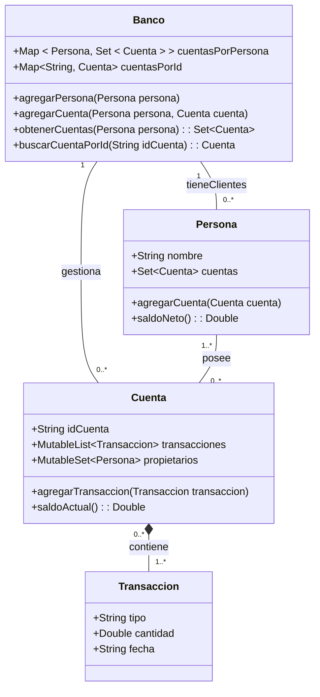

# 🏦 Ejercicio: Sistema Bancario con Kotlin usando Colecciones

Este ejercicio tiene como objetivo que los 👨‍🎓 estudiantes de tercer año de Ingeniería Informática practiquen el uso de colecciones en Kotlin (listas mutables, conjuntos mutables y mapas) mediante la creación de un sistema bancario básico. El problema abarca clases como **👤 Persona**, **💰 Cuenta**, **💸 Transacción** y **🏦 Banco** para entender cómo gestionar la relación entre personas, cuentas bancarias y transacciones.

## 📖 Descripción del Problema
El sistema bancario tiene las siguientes características:
- Una **👤 Persona** puede tener múltiples 💰 cuentas bancarias y cada cuenta puede pertenecer a varias personas (en caso de cuentas compartidas).
- Una **💰 Cuenta** tiene un identificador, una lista ordenada de **💸 Transacciones**, y se gestiona mediante el 🏦 banco.
- El **🏦 Banco** tiene clientes (personas) y gestiona las cuentas de estos. Además, el banco tiene métodos para ➕ agregar clientes, crear cuentas y 🔍 buscar cuentas por su identificador.
- Cada **💸 Transacción** tiene un tipo (depósito o retiro), una cantidad y una 📅 fecha.

A continuación se presenta un diagrama de clases en UML para ilustrar las clases, sus atributos y las relaciones entre las clases.




## 📋 Descripción de las Clases y Métodos Esperados

### Clase `🏦 Banco`
| **🛠️ Method Summary** |
| -------------------------------------------------------------------- |
| `agregarPersona(persona: Persona): Boolean` <br> ➕ Añade una nueva persona al banco como cliente y devuelve `true` si se pudo agregar, `false` en caso contrario. |
| `agregarCuenta(persona: Persona, cuenta: Cuenta): Boolean` <br> ➕ Añade una cuenta a una persona específica y devuelve `true` si se pudo agregar, `false` en caso contrario. |
| `obtenerCuentas(persona: Persona): Set<Cuenta>` <br> Devuelve el conjunto de cuentas asociadas a una persona. |
| `buscarCuentaPorId(idCuenta: String): Cuenta` <br> 🔍 Busca una cuenta por su identificador y la devuelve. |

### Clase `👤 Persona`
| **🛠️ Method Summary** |
| -------------------------------------------------------------------- |
| `agregarCuenta(cuenta: Cuenta): Boolean` <br> ➕ Añade una cuenta a la persona para actualizar su relación y devuelve `true` si se pudo agregar, `false` en caso contrario. |
| `saldoNeto(): Double` <br> 💰 Calcula el saldo neto de todas las cuentas asociadas a la persona. |

### Clase `💰 Cuenta`
| **🛠️ Method Summary** |
| -------------------------------------------------------------------- |
| `agregarTransaccion(transaccion: Transaccion): Boolean` <br> ➕ Añade una nueva transacción a la lista de transacciones y devuelve `true` si se pudo agregar, `false` en caso contrario. |
| `saldoActual(): Double` <br> 💰 Calcula el saldo actual de la cuenta en base a todas las transacciones realizadas. |

### Clase `💸 Transacción`
| **Attributes** |
| -------------------------------------------------------------------- |
| `tipo: String` <br> Tipo de transacción (e.g., "depósito" o "retiro"). |
| `cantidad: Double` <br> 💵 Cantidad de la transacción. |
| `fecha: String` <br> 📅 Fecha en la que se realiza la transacción. |

## 🎯 Objetivos del Ejercicio
1. **Familiarizarse con el uso de listas mutables, conjuntos mutables y mapas** para modelar una estructura compleja.
2. **Entender la relación entre clases** y cómo estas relaciones afectan la implementación del 💻 código.
3. **Practicar la implementación de métodos** en clases que interactúan entre sí, gestionando sus atributos y comportamientos.
4. **Comprender el uso de composición** al trabajar con clases como `Cuenta` y `Transaccion`, entendiendo cuándo una clase debe depender fuertemente de otra.

## 🔍 Ejemplo de Uso con Código `main`
A continuación, se presenta un ejemplo de cómo podría ser un programa `main` que demuestre el uso de las clases descritas:

```kotlin
fun main() {
    // Crear el banco
    val banco = Banco()

    // Crear personas
    val persona1 = Persona("Alice")
    val persona2 = Persona("Bob")

    // Agregar personas al banco
    banco.agregarPersona(persona1)
    banco.agregarPersona(persona2)

    // Crear cuentas
    val cuenta1 = Cuenta("001")
    val cuenta2 = Cuenta("002")

    // Asignar cuentas a personas
    banco.agregarCuenta(persona1, cuenta1)
    banco.agregarCuenta(persona2, cuenta2)
    banco.agregarCuenta(persona1, cuenta2) // Cuenta compartida entre Alice y Bob

    // Crear transacciones
    val transaccion1 = Transaccion("depósito", 1000.0, "2024-10-15")
    val transaccion2 = Transaccion("retiro", 200.0, "2024-10-16")

    // Agregar transacciones a las cuentas
    cuenta1.agregarTransaccion(transaccion1)
    cuenta2.agregarTransaccion(transaccion2)

    // Calcular y mostrar el saldo neto de Alice
    println("Saldo neto de Alice: ${persona1.saldoNeto()}€")

    // Calcular y mostrar el saldo neto de Bob
    println("Saldo neto de Bob: ${persona2.saldoNeto()}€")

    // Buscar una cuenta por ID y mostrar el saldo actual
    val cuentaBuscada = banco.buscarCuentaPorId("002")
    println("Saldo actual de la cuenta 002: ${cuentaBuscada.saldoActual()}€")
}
```

Este ejemplo muestra cómo se pueden crear instancias de `Banco`, `Persona`, `Cuenta` y `Transaccion`, y cómo interactúan entre sí para agregar cuentas, realizar transacciones y calcular saldos.