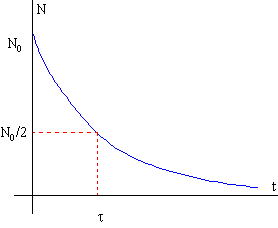

# Laboratorio 3: Creación, uso de clases y funciones 💻

## **Objetivos** 🎯

1. Familiarizarse con la documentación de las clases predefinidas.
2. Aprender a crear nuevas clases sencillas.

### Nota:

Este laboratorio está basado en los de la asignatura **_Programación_** del [**Grado en Ingeniería de Tecnologías y Servicios de Telecomunicación**](https://www.etsit.upm.es/estudios/grado-en-ingenieria-de-tecnologias-y-servicios-de-telecomunicacion.html) de la [**Universidad Politécnica de Madrid**](www.upm.es), donde fui profesor colaborador y cuyo coordinador es Juan Carlos Dueñas. 

## **Antes de la sesión de laboratorio** ⏳

Debe repasar todo lo que ha visto en el tema 3.

Conviene acostumbrarse a manejar la documentación de las clases (API) de Java que encontrará en:

[Clases predefinidas en Kotlin](https://kotlinlang.org/api/latest/jvm/stdlib/)

Busque paquete [`kotlin.math`](https://kotlinlang.org/api/latest/jvm/stdlib/kotlin.math/) y localice la descripción de sus atributos y los métodos logarítmicos y exponenciales.

También puede crear un proyecto `Labo03` si no lo tiene creado de antes.

## **Actividades** 🚀

### **Reto 1: Crear una clase con el mínimo número de atributos** 🔧

Todas las sustancias radiactivas siguen un proceso de desintegración de acuerdo con una ley exponencial decreciente. Si partimos de un número inicial de átomos radiactivos N<sub>0</sub>, al cabo de un tiempo *t*, para una sustancia radiactiva con constante de desintegración *λ*, el número de núcleos radiactivos se ha reducido a: N = N<sub>0</sub> * e<sup>-λt</sup>


<div align="center">
    
</div>

Para cada sustancia radiactiva hay un intervalo fijo, denominado *semivida* y representado por el símbolo *t*<sub>*1/2*</sub>, en el que el número de átomos que había al comienzo se ha reducido a la mitad. Si en la ecuación anterior hacemos N = N<sub>0</sub> / 2
, tenemos que:

```math
t_{1/2} = \frac{\ln 2}{\lambda}
```

<br>
<br>


El reto consiste en escribir una clase completa `ElementoRadiactivo`, con el mínimo número de atributos (2) y con los métodos necesarios para calcular la semivida y el porcentaje de desintegración pasado un tiempo. Siga estos pasos:

1. Definir el atributo o atributos característicos de la clase (mínimo 2 atributos).
2. Crear el constructor de acuerdo con los atributos elegidos (puede usar los menús de Android Studio, pero se recomienda que lo haga sin ellos).
3. Crear los métodos `toString()` y `equals()`.
4. Escribir dos métodos que, usando los métodos en el paquete `kotlin.math`, devuelvan:
    a. La semivida de la sustancia radiactiva.
    b. La proporción de átomos desintegrados pasado un tiempo *t*.

#### Ejemplos de constantes de desintegración y semividas:

<div style="text-align: center;">

| Elemento radiactivo | λ en seg⁻¹ | 
|---------------------|----------------------|
| Uranio 235          | 3,1229827968E-17     |
| Rubidio 87          | 4,5040067466E-19     |
| Radio 226           | 1,3720070489E-11     |
| Uranio 238          | 4,9193269749E-18     |
| Calcio 41           | 2,1339371771E-13     |
| Cesio 137           | 7,3094622293E-10     |

<p><em>Tabla 1: Constante de desintegración λ de algunas sustancias radiactivas.</em></p>

</div>


<div style="text-align: center;">

| Elemento radiactivo | *t*<sub>*1/2*</sub> en seg   |
|---------------------|----------------------|
| Uranio 235          | 2,22950368E+16       |
| Rubidio 87          | 1,53895680E+18       |
| Radio 226           | 5,05206720E+10       |
| Uranio 238          | 1,40902848E+17       |
| Calcio 41           | 3,24820800E+12       |
| Cesio 137           | 9,48287520E+08       |

<p><em>Tabla 2: semivida (o período de desintegración) de algunas sustancias radiactivas.</em></p>

</div>

## Métodos que debe implementar.

| **Constructor Summary**                           |
| ------------------------------------------------- |
| `ElementoRadiactivo(val nombre: String, val lambda: Double)`  <br> Constructor del elemento radiactivo; recibe como parámetros el nombre y la constante de desintegración |


| **Method Summary**                                                   |
| -------------------------------------------------------------------- |
| `getProporcionDesintegrados(t: Double): Double` <br> Devuelve un valor de 0.0 a 1.0 que corresponde a la porción de átomos radiactivos que se han desintegrado al cabo de un tiempo t sobre el número inicial de átomos, 1 - N/N0. No es necesario conocer N0. |
| `getSemivida(): Double` <br> Devuelve la semivida *t*<sub>*1/2*</sub> del elemento radiactivo: el tiempo que pasa hasta que el número de átomos inicial se ha reducido a la mitad. Es un valor único para cada elemento radiactivo, no depende del tiempo que ha pasado. |


### **Reto 2: Conocer el día de la semana de cualquier fecha - usando arrays al vuelo** 📅

Hay una fórmula para calcular el día de la semana de cualquier fecha:

```math
d = \big( (A - 1) \% 7 + \Big( \frac{A - 1}{4} - 3 \cdot \frac{\frac{A - 1}{100} + 1}{4} \Big) \% 7 + M + D \% 7 \big) \% 7
```

Donde:
- A es el año,
- D es el día, 
- M viene determinado por la siguiente tabla, dependiendo del mes y si el año es regular o bisiesto:
  
<div style="text-align: center;">

| Meses         | E | F | M | A | M | J | J | A | S | O | N | D |
|---------------|---|---|---|---|---|---|---|---|---|---|---|---|
| Año regular   | 0 | 3 | 3 | 6 | 1 | 4 | 6 | 2 | 5 | 0 | 3 | 5 |
| Año bisiesto  | 0 | 3 | 4 | 0 | 2 | 5 | 0 | 3 | 6 | 1 | 4 | 6 |

</div>


El resultado, **d**, representa el día de la semana como un número entero que va del 0 (domingo) al 6 (sábado).

Cree la clase `DiaSemana`. El método `getM()` ya está hecho y devuelve el valor de **M** según el año y mes. El reto consiste en crear el método `getDiaSemana`. Para conseguir una `String` con el nombre del día de la semana, puede crear un array al vuelo, y obtener la `String` correspondiente al número entero que obtiene al aplicar la fórmula.

#### Código para la clase `DiaSemana`:

```java
class DiaSemana {

    fun getM(a: Int, m: Int): Int {
        val mesRegular = arrayOf(0, 3, 3, 6, 1, 4, 6, 2, 5, 0, 3, 5)
        val mesBisiesto = arrayOf(0, 3, 4, 0, 2, 5, 0, 3, 6, 1, 4, 6)

        return if ((a % 4 == 0) && ((a % 100 != 0) || (a % 400 == 0))) {
            mesBisiesto[m - 1]
        } else {
            mesRegular[m - 1]
        }
    }

    fun getDiaSemana(anno: Int, mes: Int, dia: Int): String {
        // A COMPLETAR POR EL ALUMNO
        return "" // Para evitar error de compilación
    }
}
```

La ejecución del programa debería mostrar el día de la semana en texto:

```txt
Introduzca el año = 2019
Introduzca el mes (1-12) = 1
Introduzca el día del mes = 31
El día de la semana es: Jueves
```

Si supera los retos: ¡enhorabuena! Ha completado con éxito la sesión de laboratorio.
