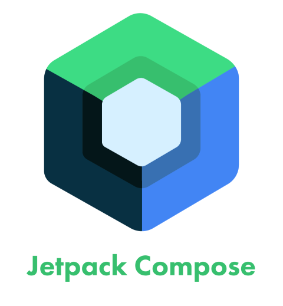
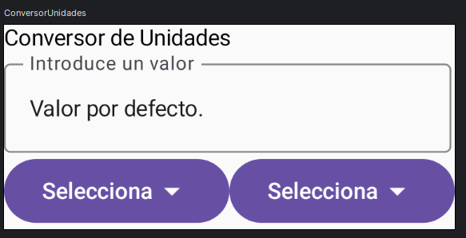

# 📓 Manual de Jetpack Compose: Construyendo tu primera interfaz gráfica

## Tabla de Contenidos📚
- [📓 Manual de Jetpack Compose: Construyendo tu primera interfaz gráfica](#-manual-de-jetpack-compose-construyendo-tu-primera-interfaz-gráfica)
- [🚀 Introducción a Jetpack Compose](#-introducción-a-jetpack-compose-1)
- [👀 Vista Previa en Android Studio](#-vista-previa-en-android-studio)
- [🍞 Botones y Toasts](#-botones-y-toasts)
- [📦 Introducción a Box Layout en Jetpack Compose](#-introducción-a-box-layout-en-jetpack-compose)
- [✨ Alineación y Modificadores](#-alineación-y-modificadores)
- [➖ Espaciado](#-espaciado)
- [📋 Menú Desplegable](#-menú-desplegable)

## 📚 Introducción a Jetpack Compose
Jetpack Compose es la herramienta moderna de Android para crear interfaces de usuario de forma más eficiente y con menos código. Compose permite diseñar de una manera declarativa, similar a otros frameworks como Flutter o React. A continuación, te vamos a construir tu primera aplicación en Android utilizando Jetpack Compose.

Web oficial de Jetpack Compose: [developer.android.com/jetpack/compose](https://developer.android.com/compose)


<div align="center">
    
</div>

## 🛠 Creación del proyecto inicial
1. **Crear un nuevo proyecto:** Ve a Android Studio y selecciona **Nuevo Proyecto**.
2. **Seleccionar "Empty Activity":** Dentro de la ventana de selección de plantillas, elige **Empty Activity** (actividad vacía). Esto nos permitirá trabajar con un espacio limpio para implementar Jetpack Compose.
3. **Asignar nombre al proyecto:** Ponle un nombre a la aplicación. En este caso, lo llamaremos "Conversor de Unidades".
4. **Asigna un namespace:** Elige un namespace para tu aplicación. Por ejemplo, `es.uva.inf5g.psm.conversorunidades`.
5. **Click en "Finalizar":** Haz clic en **Finalizar** para crear el proyecto y Android Studio configurará todo lo necesario.

> 💡 **Nota:** Durante la configuración del proyecto, Gradle puede tardar un poco, dependiendo del rendimiento de tu computadora.

## 📁 Explorando la estructura del proyecto
- Dirígete a la vista de **proyecto** en la parte izquierda del IDE.
- Los archivos importantes se encuentran en la carpeta **app** y dentro de ella, principalmente en el directorio **kotlin+java**.
- El archivo **MainActivity.kt** será donde trabajaremos para crear nuestra interfaz inicial.

## 🎨 Creando la interfaz con Jetpack Compose
Para empezar a trabajar con Jetpack Compose, nos enfocaremos en la clase `MainActivity`.

- Dentro de `MainActivity`, verás que se sobrescribe la función `onCreate()`. En esta función definimos el contenido de la aplicación utilizando `setContent {}`.
- La estructura básica de la interfaz se compone de un elemento **Scaffold**, que nos permite tener un diseño conssitente para elementos como el encabezado, cuerpo y pie de página. Si quieres saber más sobre que es un Scaffold puedes ver la [documentación oficial](https://developer.android.com/develop/ui/compose/components/scaffold?hl=es-419)
- En Compose, cada elemento visual se conoce como una **composable**. Por ejemplo, utilizamos la composable `Text()` para mostrar "Hola Android" en pantalla dentro de la función `Greetings`.

```kotlin
setContent {
            ConversorDeUnidadesTheme {
                Scaffold(modifier = Modifier.fillMaxSize()) { innerPadding ->
                    Greeting(
                        name = "Android",
                        modifier = Modifier.padding(innerPadding)
                    )
                }
            }
        }
```

## 🧩 Detalles sobre las "composables"
Una función **composable** es una función especial que define parte de la interfaz de usuario. En nuestro ejemplo:

- `ConversorDeUnidadesTheme` (Depende del nombre que hayas usado para el proyecto. Si tu proyecto se llama `Patata` este fichero se llamará `PatataTheme`) aplica el tema y colores de la aplicación.
- `Scaffold` es el contenedor principal que nos permite definir un diseño básico para la aplicación.
- `Greeting(name: String)` es una función composable que muestra un saludo personalizado.

```kotlin
@Composable
fun Greeting(name: String, modifier: Modifier = Modifier) {
    Text(
        text = "Hello $name!",
        modifier = modifier
    )
}
```

> 🤖 **Tip:** Puedes navegar por las funciones dentro de Compose manteniendo presionada la tecla **Control** (o **Command** en Mac) y haciendo clic en el nombre de la función.


## 🎨 Personalización de temas en Jetpack Compose
En Jetpack Compose, la apariencia visual de la aplicación se gestiona mediante temas, definidos con funciones como `ConversorDeUnidadesTheme` (o `UnitConverterTheme` según el nombre de tu proyecto).  
El tema controla aspectos como los colores, la tipografía y las formas de los componentes.

Dentro del tema se puede detectar si el sistema está en **modo claro** o **modo oscuro** y aplicar el esquema de colores correspondiente. Por ejemplo:

```kotlin
val darkTheme = isSystemInDarkTheme()
MaterialTheme(
    colorScheme = if (darkTheme) darkColorScheme() else lightColorScheme(),
    typography = Typography,
    content = content
)
````

> 💡 **Nota:** Puedes personalizar tus propios esquemas de color, tipografías y formas editando los archivos del paquete `ui.theme` (por ejemplo, `Color.kt`, `Theme.kt` y `Type.kt`).

En esta asignatura no vamos a entrar en la personalización de temas.

## 🚀 Ejecutando la aplicación
- Para ejecutar la aplicación, abre el **Administrador de dispositivos** y selecciona el emulador (por ejemplo, Pixel 7 que ya habíamos creado en otra práctica).
- Haz clic en el botón de **Ejecutar** para ver la aplicación en el emulador. Deberías ver un saludo que dice "Hola Android".

> 🌑 **Modo oscuro:** Puedes cambiar el modo de tu emulador a "modo oscuro" para probar cómo se ve tu aplicación con diferentes temas. Tendrás que navegar por la configuración de tu emulador de Android para ponerlo en modo oscuro. Podrás ver como la interfaz cambia automáticamente.

# 🚀 Introducción a Jetpack Compose

Jetpack Compose es una herramienta poderosa para crear interfaces de usuario (UI) de manera declarativa en Android. En lugar de usar XML, puedes definir tu UI con funciones de Kotlin llamadas **composables**. En este manual, aprenderás cómo crear tus propios composables y cómo estructurar tu UI con ellos.

## 🌟 Composables: Qué son y cómo crearlos

Los **composables** son funciones especiales que se utilizan para definir elementos de la interfaz de usuario. Para crear un composable, utilizamos el modificador `@Composable` antes de la función. Este modificador indica al compilador que la función debe tratarse de manera declarativa y define una parte de la interfaz de usuario que puede ser compuesta y recomposida.

### Ejemplo de un composable

```kotlin
@Composable
fun Greeting(name: String, modifier: Modifier = Modifier) {
    Text(
        text = "Hello $name!",
        modifier = modifier
    )
}
```

En este ejemplo, hemos creado un composable llamado `Greeting` que muestra un mensaje de texto en pantalla con el nombre que se le pase como parámetro, además de permitir modificar su apariencia a través del parámetro `modifier`.

Intenta llamar a la función `Greeting` dos veces y prueba a ver que es lo que está pasando. Para ello tendrás que modificar un poco la función `onCreate` 

```kotlin
Scaffold(modifier = Modifier.fillMaxSize()) { innerPadding ->
    // Primera llamada a Greeting
    Greeting(
    name = "Android",
    modifier = Modifier.padding(innerPadding)
    )

    // Segunda llamada a Greeting
    Greeting(
        name = "Android", 
        modifier = Modifier.padding(innerPadding)
    )
}
```


¿Qué ocurre? Aparentemente nada. ¿Verdad? ¿No debería aparecer dos veces el saludo? Efectivamente aparece, pero se pone uno encima del otro y no parece que haya ningún cambio. En la segunda llamada a la función cambia "Android" con tu nombre. ¿Qué ocurre ahora?.

Si queremos que el texto aparezca uno debajo de otro, vamos a tener que aprender una forma de estructurar la información con columnas y filas.

## 🏗 Estructurando la interfaz: Columnas y Filas

En Jetpack Compose, para organizar los elementos de la UI, utilizamos estructuras como **Columnas** (`Column`) y **Filas** (`Row`). Estos elementos ayudan a organizar los componentes composables de una manera similar a un grid.

### Columnas

Una **columna** permite apilar elementos unos debajo de otros.

```kotlin
@Composable
fun EjemploColumna() {
    Column {
        Text(text = "Primera línea")
        Text(text = "Segunda línea")
    }
}
```

En este ejemplo, los textos se apilan uno debajo del otro.

### Filas

Una **fila** permite organizar los elementos de forma horizontal, uno al lado del otro.

```kotlin
@Composable
fun EjemploFila() {
    Row {
        Text(text = "Primera línea")
        Text(text = "Segunda línea")
    }
}
```

En este caso, los textos se sitúan uno al lado del otro, de manera horizontal.

Copia estas funciones a tu proyecto. Es muy probable que tengas que importar Column `import androidx.compose.foundation.layout.Column` y Row `import androidx.compose.foundation.layout.Row` 

Ahora prueba a poner la etiqueta `@Preview(showBackground = true)` encima de las funciones y ve la vista de `preview` en el botón `split`. 

Efectivamente, puedes tener varias vistas preview. 😉

## 🎨 Declarando una UI: Composición y Re-composición

Una de las ventajas de Jetpack Compose es la capacidad de **composición** y **re-composición**. Esto significa que la UI se puede actualizar dinámicamente según el cambio de estado o datos. Por ejemplo, si el valor de una variable cambia, el elemento visual también se actualizará automáticamente.

### Estado y Datos

El **estado** juega un papel crucial en Jetpack Compose. Cuando el estado cambia, se produce una **re-composición** de la UI para reflejar estos cambios. Esto permite una interfaz reactiva y fácil de mantener.

## 💻 Creando un Convertidor de Unidades con Composables

A continuación, se presenta __un ejemplo__ más avanzado donde se crea un composable que actúa como un convertidor de unidades:

```kotlin
@Composable
fun ConversorUnidades(modifier: Modifier) {
    Column {
        Text(text = "Introduce un valor a convertir:")
        TextField(value = "", onValueChange = {}, modifier = Modifier)
        Row {
            Text(text = "Opcion 1")
            Text(text = "Opcion 2")
        }
        Text(text = "Resultado: ")
    }
}
```

En este composable, hemos creado un convertidor de unidades simple que tiene:

- Un campo de texto para ingresar un valor.
- Dos opciones de selección (en una fila).
- Un texto para mostrar el resultado.

## 📝 Campos de texto en Jetpack Compose

En Jetpack Compose, los **campos de texto** permiten a los usuarios ingresar información. Existen tres tipos principales de campos de texto:

1. **TextField**: Un campo de texto estándar con varias propiedades que se pueden personalizar.
2. **BasicTextField**: Un campo de texto básico que permite un control más bajo nivel sobre su apariencia y comportamiento.
3. **OutlinedTextField**: Un campo de texto con un borde delineado que proporciona una apariencia más definida y estructurada.

### Ejemplo de uso de `OutlinedTextField`

Vamos a trabajar con un `OutlinedTextField` y para ello sería muy deseable que [revisaras la documentación](https://developer.android.com/develop/ui/compose/text/user-input)

Primero de todo vamos a eliminar las funciones `Greeting` y que hemos creado y que ya no tienen sentido.

Después vamos a crear una función llamada `ConversorUnidades' que será un `@Composable' indicando que esta será nuestra vista y la llamaremos desde `MainActivity`, sustituyendo la llamada a `Greeting`.

Esta función queremos que contenga una Columna y dentro de la columna un `Text` que diga "Conversor de unidades". 

El siguiente elemento será un `OutlinedTextField` para que el usuario pueda introducir un valor. Lo vamos a parametrizar diciendo que `value` será una cadena vacía y que `onValueChange` será una función lambda que no haga nada por ahora.

Nos quedaría algo de la siguiente manera:

```kotlin
@Composable
fun ConversorUnidades(modifier: Modifier) {
    Column {
        Text(text = "Conversor de Unidades")
        OutlinedTextField(
            value = "",
            onValueChange = { 
                // Aquí irá la lógica para actualizar el valor.
            }
        )
    }
}
```

Probemos a ver qué tal se ve en el emulador.
Recuerda que siempre puedes hacer una preview colocando la etiqueta `@Preview(showBackground = true)` encima de la función y ver la vista de `preview` en el botón `split`.

Si quieres probar a llamar a la función `ConversorUnidades` desde `MainActivity`, simplemente reemplaza la llamada a `Greeting` con `ConversorUnidades()` dentro de `setContent`. Pero cuidado!! Debes mandar un `modifier` a la función, aunque luego no lo usemos. Quedaría algo así:

```kotlin
setContent {
            ConversorDeUnidadesTheme {
                Scaffold(modifier = Modifier.fillMaxSize()) { innerPadding ->
                    ConversorUnidades(
                        modifier = Modifier
                            .padding(innerPadding)
                            .padding(16.dp) // padding interno opcional
                    )
                }
            }
        }
```

## 🔄 La propiedad `onValueChange`

La propiedad `onValueChange` es esencial cuando se trabaja con campos de texto, ya que permite definir qué sucede cada vez que el usuario cambia el valor del campo. Por ejemplo, podrías actualizar el estado de la interfaz o realizar alguna validación en tiempo real.

```kotlin
@Composable
fun ConversorUnidades(modifier: Modifier = Modifier) {
    // Declaramos un estado para almacenar el texto
    var textValue by remember { mutableStateOf("") }

    Column(modifier = modifier.padding(16.dp)) {
        Text(text = "Conversor de Unidades")
        OutlinedTextField(
            value = textValue, // usamos la variable de estado
            onValueChange = { newValue ->
                textValue = newValue // actualizamos el estado
            },
            label = { Text("Introduce un valor") }
        )
    }
}


```

OJO! tendrás que importar varios elementos para que funcione. 

### 💡 Tip: Funciones anónimas

La función `onValueChange` a menudo usa una **función lambda** o **función anónima** que no tiene nombre, pero que puede ejecutar código directamente. Esto es útil para manejar cambios de estado sin necesidad de definir una función separada.

## 🌟 Ejemplo completo

Vamos a ver un ejemplo completo de cómo podríamos implementar un conversor de unidades con un `label` y un `placeholder`.
Un `label` es el texto que aparece encima del campo de texto y un `placeholder` es el texto que aparece dentro del campo de texto cuando está vacío.


```kotlin
Column {
    Text(text = "Conversor de Unidades")
    OutlinedTextField(
        value = "Valor por defecto.",
        onValueChange = { 
        },
        label = { Text("Introduce un valor") },
        placeholder = { Text("Escribe aquí...") }
    )
}
```


## 🎨 Personalización de campos de texto

Los campos de texto en Jetpack Compose son altamente personalizables. Puedes modificar su estilo visual, como el color del borde, el color del texto y otros aspectos de la interfaz.

Detrás de el parámetro `placeholder` puedes añadir más propiedades como `colors` para personalizar los colores del campo de texto. Aquí te dejo un ejemplo.

```kotlin
            colors = TextFieldDefaults.colors(
                focusedContainerColor = Color.Transparent,
                unfocusedContainerColor = Color.Transparent,
                focusedIndicatorColor = Color.Red,
                unfocusedIndicatorColor = Color.Gray
            )
```

Nota: es muy probable en el modo `preview` no veas los cambios de color. Para verlos, ejecuta la aplicación en un emulador o dispositivo físico.

# 👀 Vista Previa en Android Studio

En este manual exploraremos el uso de la vista previa en Jetpack Compose, una herramienta esencial para visualizar los cambios en la interfaz de usuario mientras desarrollamos nuestra aplicación.

## 🌟 ¿Qué es la Vista Previa?
La **vista previa** en Jetpack Compose es una forma de ver el diseño de nuestras composiciones sin tener que ejecutar toda la aplicación en un dispositivo o emulador. Esto nos permite trabajar de forma más rápida y eficiente al realizar cambios en la interfaz gráfica.

### 🚀 Ventajas de la Vista Previa
- **Actualización Automática**: Podemos ver los cambios en tiempo real mientras editamos nuestro código, lo cual evita la necesidad de compilar y ejecutar la aplicación cada vez que hacemos un cambio.
- **División de Pantalla**: Nos permite trabajar con el editor de código y ver la vista previa al mismo tiempo, facilitando la edición y el diseño.
- **Varias vistas previas**: Podemos tener varias previews a la vez.


## 🛠️ Cómo Crear una Vista Previa
La mejor forma de trabajar con una vista previa, es crear una función que se4 llame como la función con la que se empieza la vista, es decir, la raíz de la vista y que acabe con la palabra 'Preview' y Para crear una vista previa, debemos utilizar las anotaciones `@Preview` y `@Composable`:

```kotlin
@Preview
@Composable
fun ConversorUnidadesPreview(modifier: Modifier = Modifier) {
    ConversorDeUnidadesTheme {
        ConversorUnidades(
            modifier = Modifier
                .padding()
                .padding(16.dp) // padding interno opcional
        )
    }
}
```

Para nuestro caso creamos una función llamada `ConversorUnidadesPreview` y la etiquetaremos como `@Preview` y `@Composable`

### ✨ Explicación de las Anotaciones
- `@Preview`: Esta anotación indica que la función debe mostrarse en la vista previa del editor.
- `@Composable`: Define una función composable, que es un bloque de construcción fundamental en Jetpack Compose para definir la interfaz de usuario.

En el ejemplo, `ConversorUnidadesPreview` es nuestra función de vista previa, y llama a la función `ConversorUnidades()`, que es el nodo raíz de la interfaz que queremos previsualizar.

## 🖼️ Personalización de la Vista Previa
Podemos personalizar la vista previa de varias formas:

- **Fondo Visible**: Podemos agregar un fondo a la vista previa utilizando el parámetro `showBackground` para hacer más clara la visualización de los elementos.

```kotlin
@Preview(showBackground = true)
@Composable
fun ConversorUnidadesPreview(modifier: Modifier = Modifier) {
    ...
}
```

Esto agrega un fondo blanco, lo que facilita la lectura de los elementos en pantalla.

## Modo Oscuro
Si estamos trabajando en un tema oscuro, podemos cambiar el fondo de la vista previa para que se ajuste mejor al diseño. Para ello, podemos utilizar el parámetro `darkTheme`:

```kotlin
@Preview(showBackground = true, uiMode = android.content.res.Configuration.UI_MODE_NIGHT_YES)
@Composable
fun ConversorUnidadesPreview() {
    ...
}
```
Nota: es posible que no se vean los cambios reflejados en `preview` prueba en el modo emulación.

# 🍞 Botones y Toasts

En este manual vamos a cubrir dos temas principales:

- **Botones en Jetpack Compose**: Elementos interactivos que permiten al usuario realizar acciones.
- **Toasts**: Pequeños mensajes emergentes que proporcionan feedback al usuario.

---

## 🖱️ Creación de un Botón

Para crear un botón en **Jetpack Compose**, usamos la función `Button()`. A continuación, te mostramos un ejemplo:

```kotlin
Button(onClick = { /* acción a realizar */ }) {
    Text("Pincha aquí.")
}
```

En este ejemplo:

- `onClick` define la acción que se ejecutará cuando el botón sea presionado.
- Dentro del botón, usamos `Text()` para definir el texto que se mostrará, en este caso: "Click me".

Una vez creado el botón, al ser clicado se ejecutará la acción especificada en `onClick`.

Vamos a colocar este botón debajo del objeto `OutlinedTextField` en una nueva fila con la función `Row`:

```kotlin
@Composable
fun ConversorUnidades(modifier: Modifier) {
    Column {
        Text(text = "Conversor de Unidades")
        OutlinedTextField(
            value = "Valor por defecto.",
            onValueChange = {
            },
            label = { Text("Introduce un valor") },
            placeholder = { Text("Escribe aquí...") },
            colors = TextFieldDefaults.colors(
                focusedContainerColor = Color.Transparent,
                unfocusedContainerColor = Color.Transparent,
                focusedIndicatorColor = Color.Red,
                unfocusedIndicatorColor = Color.Gray
            )
        )
        Row{
            Button(onClick = { /* acción a realizar */ }) {
                Text("Pincha aquí.")
            }
        }
    }
}
```

Si te fijas al pulsar el botón, no se realiza ninguna acción. En el siguiente apartado veremos cómo añadir una acción al botón.

### 🔄 Personalización del Botón
Podemos personalizar el texto del botón para que diga algo más persuasivo, como "Haz clic aquí!". Además, el botón tiene una pequeña animación por defecto cuando se pulsa, lo cual mejora la experiencia de usuario.

Puedes revisar  [la documentación aquí](https://developer.android.com/develop/ui/compose/components/button)

---

## 🍞 ¿Qué es un Toast?

Un **toast** es un pequeño mensaje emergente que aparece en la parte inferior de la pantalla para proporcionar feedback al usuario. No es algo "comestible" como el nombre podría sugerir 😄. Es una herramienta útil para informar sobre acciones realizadas.

Revisa la documentación de los [Toast](https://developer.android.com/guide/topics/ui/notifiers/toasts)

---

## 🚀 Creación de un Toast

Para crear un **toast** en Jetpack Compose, necesitamos tener acceso al **contexto**. El contexto indica en qué parte de la aplicación se deberá mostrar el mensaje.

### Paso a Paso:

1. **Obtener el Contexto**
   
   Primero necesitamos obtener el contexto local usando `LocalContext.current`:

   ```kotlin
   val context = LocalContext.current
   ```

Es posible que tengas que importar la clase `LocalContext` si no se ha importado automáticamente.

Y esta instrucción debes llamarlo antes de definir el botón. Es decir quedaría algo así:

```kotlin
Row{
    val context = LocalContext.current
    Button(onClick = { /* acción a realizar */ }) {
        Text("Pincha aquí.")
    }
}
```

Más adelante pasaremos el contexto al toast.

2. **Crear y Mostrar el Toast**

   Usamos la clase `Toast` para crear y mostrar el mensaje emergente:

   ```kotlin
   Toast.makeText(context, "Gracias por pulsar!", Toast.LENGTH_LONG).show()
   ```

   En este ejemplo:

   - `context` es el contexto en el cual se mostrará el toast.
   - El segundo parámetro es el texto que se mostrará.
   - `Toast.LENGTH_LONG` indica la duración del mensaje (puede ser **corto** o **largo**).

---

## 🎯 Integración del Toast en el Botón

Vamos a ver cómo podemos integrar un **toast** en la acción del botón:

```kotlin
val context = LocalContext.current

Button(onClick = {
    Toast.makeText(context, "Gracias por pulsar!!", Toast.LENGTH_LONG).show()
}) {
    Text("Pincha aquí.")
}
```

Con este código, cada vez que el usuario presione el botón, se mostrará un toast con el mensaje "Gracias por hacer clic".

OJO! No te olvides de lanzar la función `show()` para que el toast se muestre.

# 📦 Introducción a Box Layout en Jetpack Compose

Ahora aprenderemos a usar el **Box layout** para crear menús desplegables en nuestras aplicaciones.

En esta parte vamos a tratar de hacer la siguiente interfaz:

<div align="center">
    
</div>

Si te fijas bien, en la parte de los botones tenemos una fila, ya que un botón está al lado del otro. Además, los botones tienen un ícono de flecha hacia abajo para indicar que son menús `dropdown` es decir, que al hacer clic en ellos se desplegará una lista de opciones.
Pero además, cada botón lo vamos a colocar en un `Box` para poder manejarlos mejor.

[Más info sobre layouts en Compose.](https://developer.android.com/develop/ui/compose/layouts/basics)


## 🎯 ¿Qué es Box?

En Jetpack Compose, un **Box** es un elemento de diseño que permite colocar otros elementos uno encima del otro. Es muy útil para crear layouts personalizados y complejos, ya que apila los composables (elementos de interfaz) en la pantalla.

### 📌 Propiedades clave del Box

- **Participación en el diseño**: Un Box puede ser utilizado para participar en la disposición de otros elementos, el dibujo en la pantalla y la entrada de puntero gracias a su modificador.
- **Apilamiento de elementos**: Los elementos que contiene se apilan uno sobre otro, lo que lo hace ideal para elementos superpuestos.

---

## 🚀 Creación de un menú desplegable con Box

En este ejemplo, vamos a crear un menú desplegable utilizando un **Box** y un **Button**. El menú mostrará una lista de opciones cuando el usuario haga clic en el botón.

### 🔧 Pasos para implementar el menú desplegable
0. **Antes de continuar** 
    Vamos a vaciar lo que tenemos dentro de `Row` ya que era solo un ejemplo y no lo vamos a necesitar en este caso. Asegúrate de tenerlo así:
    ```kotlin
    Row{

        }
    ```
    OJO! todo lo demás debe permanecer igual.

1. **Agregar un Box en el layout**  
   Primero, colocamos un `Box` dentro de un `Row` para contener los elementos. El `Box` es otro elemento composable que seguramente necesitemos importar antes de usar.
      

2. **Añadir un botón dentro del Box**  
   Dentro del `Box`, agregamos un `Button`. El botón mostrará un texto y un ícono, indicando que se trata de un menú desplegable.
   
    ```kotlin
    Row{
        Box {
            Button(onClick = { /* TODO */ }) {
                Text("Selecciona")
                Icon(
                    Icons.Default.ArrowDropDown,
                    contentDescription = "Flecha hacia abajo"
                )
            }
        }
    }
    ```

3. **Añadir accesibilidad**  
   Es importante definir una descripción para el ícono mediante el parámetro `contentDescription`, lo cual mejora la accesibilidad. Este parámetro permite que los servicios de accesibilidad describan la función del ícono para personas con discapacidades visuales.

   Es muy parecido a HTML donde se usa el atributo `alt` en las imágenes.

4. **Añade otro botón a la derecha**  
   Simplemente con copiar el código que acabamos de crear `Box` y pegarlo debajo, tendremos replicado el botón y por lo tanto se nos mostrarán dos botones uno al lado del otro.

---

## 🔍 Consideraciones finales

Aunque el **Box** es un elemento de disposición básico en Jetpack Compose, es muy poderoso para crear interfaces personalizadas y complejas. En este ejemplo, lo usamos para implementar un menú desplegable, pero sus aplicaciones son mucho más amplias.

### 📈 Mejorando la disposición del layout

Al colocar elementos dentro de un **Box**, podemos enfrentarnos a situaciones donde la interfaz no se vea como esperamos (por ejemplo, todos los elementos alineados en la esquina superior izquierda). Para mejorar esto, podemos aplicar modificadores que ajusten la posición y alineación de los elementos:

```kotlin
Box (modifier = Modifier
            .padding(16.dp),
            contentAlignment = Alignment.Center) {
    // Elementos del Box
}
```

De momento no es necesario que entiedas que pasa. Simplemente quiero que hagas una prueba y que veas que ocurre.
 
En los siguientes temas vamos a profundizar en otros elementos de diseño y disposición en Jetpack Compose.

# ✨ Alineación y Modificadores

Vamos a aprender cómo alinear elementos en Jetpack Compose y cómo asegurarnos de que nuestra aplicación tenga un aspecto profesional, con los elementos de la interfaz de usuario bien posicionados. Jetpack Compose nos permite personalizar y alinear los componentes de nuestra app de forma precisa, logrando diseños visualmente atractivos y funcionales.

## 🖼️ Personalización y Modificadores

La personalización en Android Studio nos permite modificar la apariencia de los elementos de la interfaz de usuario, como los colores, estilos de texto y formas, para que coincidan con el tema de nuestra aplicación. En Jetpack Compose, cada elemento tiene un parámetro llamado `modifier`, que se utiliza para agregar propiedades adicionales a los componentes.

Algunas propiedades que se pueden controlar con los modificadores son:
- **Padding**: Espaciado alrededor del componente.
- **Tamaño**: Definir el ancho y alto de los elementos.
- **Posicionamiento**: Ajustar la posición de los elementos dentro de sus contenedores.

Nota: Todos los elementos para la personalización y modificadores lo haremos entre los paréntisis del elemento que queremos modificar.

Vamos a hacer ejemplos con la columna.

### Ejemplo de uso del `modifier`

```kotlin
Column(modifier = Modifier.fillMaxSize()) {
    // Contenido de la columna
}
```

En el ejemplo anterior, utilizamos el modificador `fillMaxSize()` para hacer que la columna ocupe todo el espacio disponible.

Probablemente no notes la diferencia si lo ven en modo de emulación. Pero si lo ves en modo de preview, verás que la columna ocupa todo el espacio disponible.

## 📐 Alineación de Elementos

La alineación de elementos es un aspecto esencial para diseñar interfaces de usuario. En Jetpack Compose, podemos alinear componentes dentro de sus contenedores padres utilizando propiedades como **alignment** y **arrangement**.

### Contenedores Padres o Parents

En nuestro ejemplo, los elementos se agrupan en contenedores como **Box**, **Row** y **Column**. Cada uno de estos contenedores puede contener otros elementos, y cada uno de ellos tienen un padre. 

Por ejemplo:
- Un **Botón** está dentro de una **Box**: La `Box` es el contenedor padre del botón.
- Una **Box** está dentro de una **Row**: La `Row` es el contenedor padre de la `Box`.
- Una **Row** está dentro de una **Column**: La `Column` es el contenedor padre de la `Row`.

¿Te das cuenta que con esta organización los `composables` se pueden anidar en forma de árbol? 

### Tipos de Alineación

Jetpack Compose ofrece diferentes opciones de alineación para ajustar la posición de los elementos:
- **Vertical**: Alinear elementos en la parte superior, central o inferior del contenedor.
- **Horizontal**: Alinear elementos a la izquierda, al centro o a la derecha del contenedor.

Por ejemplo, dentro de una `Column` podemos utilizar `verticalArrangement` para definir cómo queremos que se distribuyan los elementos verticalmente:

```kotlin
Column(
    modifier = Modifier.fillMaxSize(),
    verticalArrangement = Arrangement.Center
) {
    // Contenido de la columna
}
```

En este ejemplo, usamos `verticalArrangement = Arrangement.Center` para alinear los elementos en el centro de la columna.

Prueba con distintos valores para `Arrangement` y observa cómo cambia la disposición de los elementos. Por ejemplo: `Arrangement.Bottom`, `Arrangement.Top`, `Arrangement.SpaceEvenly`, `Arrangement.SpaceAround`, etc.

### Alineación Horizontal

Además, podemos alinear los elementos horizontalmente usando `horizontalAlignment`:

```kotlin
Column(
    modifier = Modifier.fillMaxSize(),
    horizontalAlignment = Alignment.CenterHorizontally
) {
    // Contenido de la columna
}
```

En este caso, estamos alineando los elementos horizontalmente al centro del contenedor.

## 🚀 Alineación y Distribución en la Pantalla

Para crear una interfaz bien equilibrada, podemos combinar propiedades como `fillMaxWidth`, `fillMaxHeight`, y utilizar alineaciones específicas para definir cómo se distribuyen los elementos en la pantalla.

- **`fillMaxWidth()`**: Ocupa todo el ancho disponible.
- **`fillMaxHeight()`**: Ocupa toda la altura disponible.
- **`fillMaxSize()`**: Ocupa todo el espacio disponible (ancho y alto).

Esto nos da control sobre cómo se comportan los elementos dentro de su contenedor. Por ejemplo, si queremos que un componente ocupe todo el ancho pero solo una parte de la altura, podemos usar `fillMaxWidth()` junto con un valor específico para la altura.

# ➖ Espaciado 

Vamos a explorar dos formas principales de añadir espaciado entre elementos en Jetpack Compose: el modificador **Padding** y el elemento **Spacer**. Ambos se utilizan para mejorar la organización de la interfaz de usuario, pero cada uno tiene sus pros y contras que analizaremos a continuación.

Si te fijas la interfaz de usuario que hemos creado está bien, pero los elementos se ven muy juntos entre ellos. Vamos a ver cómo podemos solucionar esto utilizando **Padding** y **Spacer**.

## 🛠 Padding vs Spacer
En Jetpack Compose, cuando deseas agregar espaciado entre elementos, existen dos maneras principales de hacerlo:

1. Usar el **modificador Padding**.
2. Introducir un **elemento Spacer**.

Ambos enfoques tienen ventajas y desventajas, y la elección entre ellos depende de tus preferencias de diseño y necesidades específicas.

### ✅ Pros y Contras del Modificador Padding
- **Pros**:
  - **Simplicidad**: Es muy fácil de usar, solo tienes que añadir el modificador padding alrededor del elemento que deseas espaciar.
  - **Rápido**: Se aplica directamente al composable que deseas modificar, lo que lo hace directo y rápido.

- **Contras**:
  - **Reusabilidad limitada**: Si necesitas un espaciado consistente entre varios elementos, debes aplicar el modificador individualmente cada vez. Esto puede ser tedioso y poco eficiente si tienes muchos elementos.

### 🔄 Pros y Contras del Elemento Spacer
- **Pros**:
  - **Reusabilidad**: El elemento **Spacer** se puede utilizar para crear espaciados consistentes entre varios elementos sin tener que aplicar el modificador de padding a cada uno por separado.
  - **Intención clara**: Al usar un Spacer, comunicas claramente tu intención de diseño, haciendo que tu código sea más autodescriptivo.

- **Contras**:
  - **Complejidad**: Agregar un elemento composable adicional puede incrementar la verbosidad del código ligeramente, haciendo que la estructura sea un poco más compleja.

## 🎯 Cuándo Elegir Cada Opción
La elección entre usar el **modificador Padding** y el **elemento Spacer** depende de tu caso de uso específico:

- Si necesitas un control preciso o solo quieres espaciado alrededor de un elemento en particular, el **modificador Padding** es conveniente.
- Si deseas espaciado consistente entre varios elementos, el **elemento Spacer** ofrece una solución más limpia y reutilizable.

De manera general vamos a usar siempre que podamos el **Spacer**, ya que nos permite tener un código más limpio y reutilizable.

## 📝 Ejemplo de Uso de Spacer
Veamos cómo utilizar el elemento **Spacer** en Jetpack Compose. Podemos ver que entre `Text` y `OutlinedTextField` estaría bien poder tener un poco de espacio. Para ello vamos a incluir un objeto visual llamado `Spacer` entre ellos.

```kotlin
Spacer(modifier = Modifier.height(16.dp))
```

En este ejemplo, usamos el **Spacer** para crear un espaciado de 16dp entre el texto y el campo de texto. Esto ayuda a mantener la interfaz de usuario limpia y fácil de leer.

## 📐 Comprendiendo el DP
El **dp** (density pixel) se utiliza para definir dimensiones relativas que se ajustan a diferentes pantallas. Utilizar **dp** en lugar de píxeles garantiza que la interfaz de usuario se vea correctamente en dispositivos con diferentes densidades de pantalla.

Por ejemplo, al definir un **Spacer** de `16.dp`, nos aseguramos de que el espaciado se vea adecuado en cualquier dispositivo, independientemente de la cantidad de píxeles por pulgada que tenga la pantalla.

Si quieres saber más sobre la diferencia entre **dp** y **px**, puedes consultar más referencias:

- [Diferencias entre PX, DP y SP en Android](https://openwebinars.net/blog/diferencias-entre-px-dp-y-sp-en-android/).
- [¿Cuál es la diferencia entre px, dip. dp, y sp en Android?](https://es.stackoverflow.com/questions/136/cu%C3%A1l-es-la-diferencia-entre-px-dip-dp-y-sp-en-android)
- [Calculadora de píxeles](https://pixelcalculator.com/es)

## 👀 Visualizando el Cambio
Si ejecutamos nuestra aplicación después de añadir los **Spacer**, podemos notar un cambio claro en la distribución de los elementos. Cada **Spacer** crea una separación visual que mejora la experiencia del usuario, evitando que los elementos estén "apretados" entre sí.

Coloca otro **Spacer** después del `OutlinedTextField`.

Entre los botones también añade un **Spacer** para separarlos. Pero esta vez tienes que poner una separación a lo anchos, por lo que usaremos el modificador `width`.

```kotlin
Spacer(modifier = Modifier.width(16.dp))
```

# 📋 Menú Desplegable

Vamos a aprender a implementar una lista de opciones que se muestran al presionar un botón, lo que se conoce como un `dropdownn menu`. Esta funcionalidad es útil para aplicaciones como un convertidor de unidades, donde el usuario necesita seleccionar entre varias opciones.
 
## 🚀 Creando el Menú Desplegable

Un menú desplegable en Jetpack Compose se logra con el componente `DropdownMenu`, el cual se encarga de mostrar una lista de opciones usando su elemento hijo `DropdownMenuItem`.

### 📝 Estructura del Menú

El menú desplegable tiene las siguientes partes:

- **Contenedor**: El contenedor general que aloja el menú y su disparador (trigger).
- **Evento de click**: Un botón que, al ser presionado, despliega el menú con las opciones.
- **Items del Menú**: Los elementos individuales que el usuario puede seleccionar dentro del menú.

Vamos a añadir el siguiente código después de llamar a la primera función `Button`:

```kotlin
DropdownMenu(expanded = false,
onDismissRequest = {/*TODO*/ }) {

}
```
OJO! La información de los elementos que tendremos dentro del menú se colocan después del botón y NO DENTRO del `Button`.

`onDismissRequest` es un evento que se dispara cuando el menú se cierra. En este caso, no haremos nada, por lo que colocamos un comentario.

### 📦 Añadiendo Elementos al Menú 
Dentro de los corchetes del `DropdownMenu`, añadimos los elementos del menú con el componente `DropdownMenuItem`. 

```kotlin
DropdownMenuItem(text={Text("Centímetros")}, onClick = {/*TODO*/})
```

Añade varios elementos al menú, cada uno con un texto diferente. Por ejemplo: "Metros", "Pies", "Milímetros".

El evento `onClick` se dispara cuando el usuario selecciona un elemento del menú.


### 🔧 Ejemplo de Implementación

Vamos a explorar cómo crear un menú desplegable para una aplicación que permita seleccionar entre diferentes unidades de longitud:

1. **Creación del Componente `DropdownMenu`**:
   - Primero, definimos una variable booleana llamada `expanded` para determinar si el menú está abierto o cerrado. Inicialmente, esta variable debería ser `false`, lo que indica que el menú comienza cerrado.

   ```kotlin
   var expanded by remember { mutableStateOf(false) }

   DropdownMenu(
       expanded = expanded,
       onDismissRequest = { expanded = false }
   ) {
       // Aquí se agregarán los elementos del menú
   }
   ```

2. **Items del Menú**:
   - Cada opción dentro del menú se define mediante `DropdownMenuItem`. Cada item tiene un componente de texto y un evento `onClick`.
   - Ejemplo de cómo agregar varios elementos al menú desplegable:

```kotlin
DropdownMenu(expanded = false,
        onDismissRequest = {/*TODO*/ }) {
        DropdownMenuItem(
            text = { Text("Centímetros") },
            onClick = {/*TODO*/ })
        DropdownMenuItem(
            text = { Text("Metros") },
            onClick = {/*TODO*/ })
        DropdownMenuItem(
            text = { Text("Pies") },
            onClick = {/*TODO*/ })
        DropdownMenuItem(
            text = { Text("Milímetros") },
            onClick = {/*TODO*/ })
    }
```

Ahora copia el DropdownMenu y sus DropdownMenuItem en el otro botón.

3. **Desplegar el Menú**:

Te darás cuenta que el menú no se despliega en la vista de preview. ¿Has probado en la emulación?

Efectivamente, no se ve nada. Eso es debido a que todavía no tenemos nada probramado en los eventos `onClick` de los botones. Eso lo haremos en el siguiente laboratorio, de momento solo hemos visto parte de la vista, pero más adelante vamos a ver el modelo y la lógica de la aplicación.

## 🔧 Solución

🎉 ¡Enhorabuena! Si has llegado hasta aquí, ya tienes tu primera vista realizada en **Jetpack Compose**. ✨ La vista debería tener un aspecto similar a este. Pero, por favor, solo revisa el **código** 👀 si te has atascado; intenta hacerlo por tu cuenta.

<details>
  <summary>Haz clic para ver el código</summary>

```kotlin
package es.uva.inf5g.psm.conversordeunidades

import android.os.Bundle
import androidx.activity.ComponentActivity
import androidx.activity.compose.setContent
import androidx.activity.enableEdgeToEdge
import androidx.compose.foundation.layout.Arrangement
import androidx.compose.foundation.layout.Box
import androidx.compose.foundation.layout.Column
import androidx.compose.foundation.layout.Row
import androidx.compose.foundation.layout.Spacer
import androidx.compose.foundation.layout.fillMaxSize
import androidx.compose.foundation.layout.height
import androidx.compose.foundation.layout.padding
import androidx.compose.foundation.layout.width
import androidx.compose.material3.Button
import androidx.compose.material3.DropdownMenu
import androidx.compose.material3.DropdownMenuItem
import androidx.compose.material3.Icon
import androidx.compose.material3.OutlinedTextField
import androidx.compose.material3.Scaffold
import androidx.compose.material3.Text
import androidx.compose.runtime.Composable
import androidx.compose.ui.Alignment
import androidx.compose.ui.Modifier
import androidx.compose.ui.tooling.preview.Preview
import androidx.compose.ui.unit.dp
import androidx.compose.material.icons.Icons
import androidx.compose.material.icons.filled.ArrowDropDown


import es.uva.inf5g.psm.conversordeunidades.ui.theme.ConversorDeUnidadesTheme

class MainActivity : ComponentActivity() {
    override fun onCreate(savedInstanceState: Bundle?) {
        super.onCreate(savedInstanceState)
        enableEdgeToEdge()
        setContent {
            ConversorDeUnidadesTheme {
                Scaffold(modifier = Modifier.fillMaxSize()) { innerPadding ->
                    ConversorUnidades(
                        modifier = Modifier
                            .padding(innerPadding)
                            .padding(16.dp) // padding interno opcional
                    )
                }
            }
        }
    }
}

@Composable
fun ConversorUnidades(modifier: Modifier) {
    Column(
        modifier = Modifier.fillMaxSize(),
        verticalArrangement = Arrangement.Top,
        horizontalAlignment = Alignment.CenterHorizontally
    ) {
        Text(text = "Conversor de Unidades")
        Spacer(modifier = Modifier.height(16.dp))
        OutlinedTextField(
            value = "Valor por defecto.",
            onValueChange = {
            },
            label = { Text("Introduce un valor") },
            placeholder = { Text("Escribe aquí...") }
        )
        Spacer(modifier = Modifier.height(16.dp))
        Row {
            Box(
                modifier = Modifier
                    .padding(16.dp),
                contentAlignment = Alignment.Center
            ) {
                Button(onClick = { /* TODO */ }) {
                    Text("Selecciona")
                    Icon(
                        Icons.Default.ArrowDropDown,
                        contentDescription = "Flecha hacia abajo"
                    )
                }
                DropdownMenu(expanded = false,
                    onDismissRequest = {/*TODO*/ }) {
                    DropdownMenuItem(
                        text = { Text("Centímetros") },
                        onClick = {/*TODO*/ })
                    DropdownMenuItem(
                        text = { Text("Metros") },
                        onClick = {/*TODO*/ })
                    DropdownMenuItem(
                        text = { Text("Pies") },
                        onClick = {/*TODO*/ })
                    DropdownMenuItem(
                        text = { Text("Milímetros") },
                        onClick = {/*TODO*/ })
                }
            }
            Spacer(modifier = Modifier.width(16.dp))
            Box(
                modifier = Modifier
                    .padding(16.dp),
                contentAlignment = Alignment.Center
            ) {
                Button(onClick = { /* TODO */ }) {
                    Text("Selecciona")
                    Icon(
                        Icons.Default.ArrowDropDown,
                        contentDescription = "Flecha hacia abajo"
                    )
                }
            }
            DropdownMenu(expanded = false,
                onDismissRequest = {/*TODO*/ }) {
                DropdownMenuItem(
                    text = { Text("Centímetros") },
                    onClick = {/*TODO*/ })
                DropdownMenuItem(
                    text = { Text("Metros") },
                    onClick = {/*TODO*/ })
                DropdownMenuItem(
                    text = { Text("Pies") },
                    onClick = {/*TODO*/ })
                DropdownMenuItem(
                    text = { Text("Milímetros") },
                    onClick = {/*TODO*/ })
            }
        }
    }
}

@Preview(showBackground = true, uiMode = android.content.res.Configuration.UI_MODE_NIGHT_YES)
@Composable
fun ConversorUnidadesPreview(modifier: Modifier = Modifier) {
    ConversorDeUnidadesTheme {
        ConversorUnidades(
            modifier = Modifier
                .padding()
                .padding(16.dp) // padding interno opcional
        )
    }
}


```

</details>